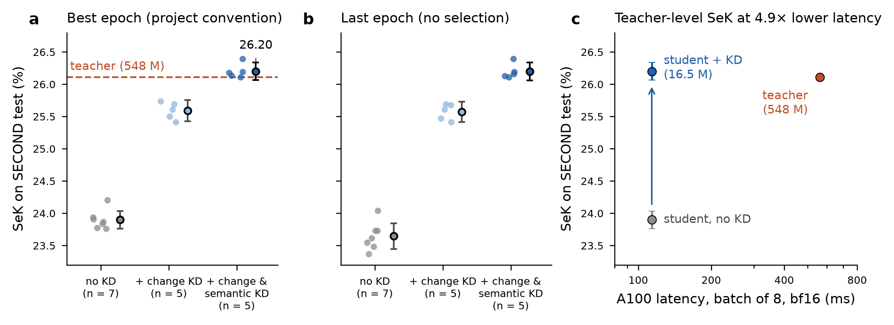
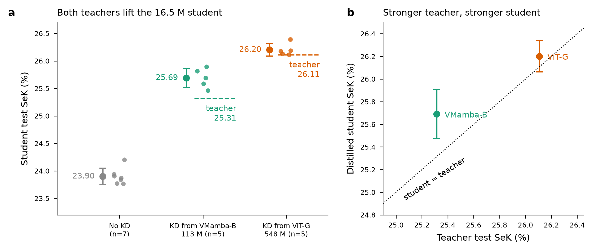

# CSF-Mamba

Architecture Mamba **efficiente** pour la **détection sémantique de changements**
(SCD) sur imagerie aérienne : à partir de deux images d'une même zone prises à
deux dates, produire la carte des zones changées **et** la classe d'occupation du
sol avant et après.

Stage de recherche, Université de Moncton — Mathis Magron, encadré par
Prof. Eric Hervet et Prof. Andy Couturier. Entraînements sur Narval
(Alliance Canada, A100).

- **Journal de bord** : `documentation/journal-de-bord.md` — chronologie complète,
  décisions, résultats de tous les runs. Matière première du rapport.
- **Conception de l'architecture** : `documentation/plan_recap_CSF-Mamba2.md`
- **Lancer un entraînement ou une évaluation** : `RUN.md`

---

## 1. Où en est le projet (10 septembre 2026)

Le pipeline est complet et validé sur GPU, sur deux jeux de données réels. La
campagne compte **~150 entraînements**, tous à plusieurs graines depuis le
7 août.

**Le résultat tient en une phrase.** Évalué avec **le même code de métriques**
sur les mêmes images, notre modèle **dépasse le checkpoint publié de MambaSCD
avec 44 % de ses paramètres, 27 % de son calcul et 1,65 fois moins de temps**.
Face aux chiffres que la littérature cite, il dépasse aussi MambaSCD-Base en
consommant 6,7 fois moins de calcul.

Deux configurations sont retenues, aux deux extrémités du compromis :

| | Paramètres | GMACs | SeK |
|---|---|---|---|
| **Point d'efficience** | **16,48 M** | **31,42** | **0,2390** |
| **Point de performance** | 32,58 M | 58,06 | **0,2485** |

Le premier **dépasse MambaSCD-Base** avec 18 % de ses paramètres. Le second
atteint **97 % du SeK de Mamba-FCS** avec 17 % des siens.

---

## 2. Tableau comparatif — SECOND

**Deux travaux servent de référence, et leurs noms prêtent à confusion.**
*ChangeMamba* est un article qui propose trois modèles ; celui qui traite notre
tâche s'appelle **MambaSCD**, décliné en Tiny, Small et Base. *Mamba-FCS* est un
article **différent**, plus récent et bien plus gros (189 M). Leurs SeK sont ceux
qu'ils publient, obtenus par leur propre code sur le même split officiel.

SECOND est le jeu de référence du domaine : 4 662 paires 512×512, 6 classes
sémantiques, split officiel. **SeK** (Separated Kappa) est la métrique consacrée
de la SCD ; elle combine la qualité de localisation du changement et celle de la
classification sémantique à l'intérieur des zones changées. Plus haut = mieux.

### Positionnement face à l'état de l'art

| Modèle | Params | GMACs | **SeK** | Origine des chiffres |
|---|---:|---:|---:|---|
| Mamba-FCS | 189,54 M | 263,15 | **0,2550** | article Mamba-FCS, table VI |
| MambaSCD-Base | 89,99 M | 211,55 | **0,2292** | article **ChangeMamba** |
| MambaSCD-Tiny | 21,51 M | 73,42 | **0,2208** | article **ChangeMamba** |
| **MambaSCD-Tiny, leur checkpoint publié** | **37,13 M** | **115,44** | **0,2334** | **mesuré par nous, même code** |
| **CSF-Mamba — performance** | **32,58 M** | **58,06** | **0,2485** | mesuré, n = 6 |
| **CSF-Mamba — efficience** | **16,48 M** | **31,42** | **0,2390** | mesuré, n = 7 |

⚠️ **Les deux lignes MambaSCD-Tiny ne décrivent pas le même modèle.** La première
reprend leur table publiée. La seconde est **leur propre checkpoint publié**,
chargé et évalué par nous : 802 tenseurs, 0 manquant, 0 inattendu — aucune
ambiguïté sur l'identité du modèle — et il compte 37,13 M paramètres, pas 21,51.
Nous mesurons son SeK à **0,2334** là où ils annoncent 0,2208.

Nous ne savons pas expliquer cet écart de +0,0126 avec certitude, et **son sens
compte** : notre chaîne leur donne un score *plus élevé* que le leur, ce qui exclut
l'hypothèse d'un modèle mal alimenté par notre code. L'explication la plus
économique est celle déjà établie deux fois — leur dépôt public a évolué après
publication, ce qui a rendu irreproductibles leur `state_dict` puis leur table de
complexité. Les deux chiffres sont donc donnés côte à côte.

**Lecture en pourcentages du modèle de référence** (100 % = à égalité) :

| | vs Mamba-FCS | vs MambaSCD-Base | vs MambaSCD-Tiny |
|---|---|---|---|
| **efficience** (16,48 M) | 94 % SeK · **9 % params** · **12 % calcul** | **104 % SeK · 18 % params · 15 % calcul** | **108 % SeK · 77 % params · 43 % calcul** |
| **performance** (32,58 M) | **97 % SeK · 17 % params · 22 % calcul** | 108 % SeK · 36 % params · 27 % calcul | 113 % SeK · 152 % params · 79 % calcul |

### L'énoncé principal : la comparaison à code identique

C'est la plus rigoureuse dont nous disposions — mêmes images, même split, **même
code de métriques des deux côtés** — et elle ne dépend d'aucun chiffre publié.

| | SeK | Params | GMACs |
|---|---:|---:|---:|
| Leur checkpoint publié, évalué par nous | 0,2334 | 37,13 M | 115,44 |
| **CSF-Mamba — efficience** | **0,2390** | **16,48 M** | **31,42** |
| | **102,4 %** | **44,4 %** | **27,2 %** |

C'est aussi la comparaison **la moins favorable pour nous** : face à leur chiffre
publié, la marge serait de 108 % au lieu de 102,4 %. Nous retenons la plus stricte.

L'IC 95 % de notre moyenne est **[0,2377 ; 0,2403]** sur 7 graines : **sa borne
basse reste au-dessus de leur 0,2334**.

Les autres énoncés, appuyés sur les chiffres que cite la littérature :

- **le point d'efficience bat MambaSCD-Base**, un modèle 5,5 fois plus gros, pour
  **15 % de son calcul** ;
- **le point de performance approche Mamba-FCS à 2,6 % près**, pour **22 % de son
  calcul**. L'objectif initial du stage — le battre — n'est pas atteint, mais
  l'écart s'est réduit de 17,5 % (recette de juillet, SeK 0,2103) à 2,6 %.

### Toutes nos configurations, par ordre de SeK

| Configuration | Params | GMACs | SeK (max) | SeK (finale) | n |
|---|---:|---:|---:|---:|---:|
| **performance** = efficience + encodeur `tiny` + supervision profonde | 32,58 M | 58,06 | **0,2485 ± 0,0011** | 0,2389 | 6 ‡ |
| **efficience** = `lean` + échange temporel + jitter + EMA | **16,48 M** | **31,42** | **0,2390 ± 0,0015** | 0,2330 | 7 |
| `lean` + encodeur `tiny` | 32,58 M | 58,06 | 0,2367 ± 0,0016 | 0,2258 | 4 |
| `lean` + échange temporel + EMA | 16,48 M | 31,42 | 0,2348 ± 0,0017 | 0,2303 | 4 |
| `lean` + échange temporel + jitter | 16,48 M | 31,42 | 0,2331 ± 0,0010 | 0,2239 | 6 ‡ |
| `lean` + échange temporel | 16,48 M | 31,42 | 0,2285 ± 0,0015 | 0,2216 | 4 |
| `lean` + EMA | 16,48 M | 31,42 | 0,2275 ± 0,0009 | 0,2238 | 4 |
| `best` = `nosek` + supervision profonde + LR constant | 20,80 M | 41,30 | 0,2264 ± 0,0020 | 0,2214 | 7 |
| `lean` = `nosek` sans C²S², LR constant | 16,48 M | 31,42 | 0,2230 ± 0,0018 | 0,2164 | 7 |
| `nosek` = recette initiale sans la loss SeK | 20,80 M | 41,30 | 0,2228 ± 0,0019 | — | 7 |
| Recette initiale (juillet) | 20,80 M | 41,30 | 0,2103 ± 0,0105 | — | 8 |

*(‡ une septième graine du point de performance tourne encore. Les deux
configurations retenues sont désormais à 7 et 6 graines, comme les lignes
consolidées.)*

**Les deux chiffres de tête ont résisté au doublement des graines** — c'est le
contrôle le plus utile de cette consolidation. L'efficience passe de 0,2387 (n=4)
à **0,2390** (n=7) et la performance de 0,2484 (n=3) à **0,2485** (n=6) : moins de
quatre dix-millièmes d'écart dans les deux cas.

En revanche l'écart-type affiché à 4 graines, 0,0007, **valait bien le double** :
0,0015 une fois mesuré sur 7. La réserve inscrite ici — un σ estimé sur 3 degrés
de liberté n'est pas fiable en lui-même — était fondée. Tous les intervalles de
confiance de ce document utilisent le σ **mis en commun** sur l'ensemble des
configurations, plus prudent.

### Vitesse et mémoire à l'inférence

Mesuré le 10 septembre sur A100, entrée 512×512, lot de 8 paires, médiane sur
50 itérations après 10 de chauffe.

*Deux précisions numériques sont rapportées.* **fp32** code chaque nombre sur
32 bits (~7 chiffres significatifs) : c'est le format historique et la référence
neutre que n'importe qui peut reproduire. **bf16** n'en utilise que 16 tout en
gardant la **même plage de valeurs** que le fp32 — mêmes bits d'exposant, mais
~3 chiffres significatifs au lieu de 7. Pour un réseau de neurones, ne pas
déborder compte plus que la précision décimale, d'où ce compromis : moitié moins
de mémoire, et des multiplications de matrices bien plus rapides sur les *tensor
cores* de l'A100. C'est le format utilisé à l'entraînement comme à l'inférence,
donc le **régime réel** ; n'en rapporter qu'un des deux cacherait quelque chose.

| Modèle | fp32 | bf16 | Mémoire crête |
|---|---:|---:|---:|
| **CSF-Mamba — efficience** (16,48 M) | **129 ms** · 62 paires/s | **114 ms** · 70 paires/s | 1,9–2,0 Go |
| **CSF-Mamba — performance** (32,58 M) | 144 ms · 56 paires/s | 125 ms · 64 paires/s | 1,9–2,1 Go |
| MambaSCD, variante publiée (19,57 M) ‖ | 252 ms · 32 paires/s | 187 ms · 43 paires/s | 4,0–5,3 Go |

Le point d'efficience est **1,95× plus rapide en fp32, 1,65× en bf16**, pour **2,1
à 2,7× moins de mémoire**. Sur une heure : 253 000 paires traitées contre 154 000.

**Le fait le plus parlant** : notre modèle de **32,58 M** (125 ms) est plus rapide
que le leur de **19,57 M** (187 ms) — 1,50× à taille supérieure.

**L'avantage rétrécit en bf16, et il faut le dire.** Leur architecture, plus
dominée par du calcul dense, profite mieux des *tensor cores* ; la nôtre est
davantage limitée par les accès mémoire (`grid_sample` en tête). La latence ne
suit donc pas les GMACs à l'identique.

‖ Variante à branche MLP désactivée, celle qui correspond à leur table publiée.
Elle mesure **19,57 M**, à 9 % de leurs 21,51 M annoncés — reconstruction établie
en août et reproduite ici à l'identique. Une première mesure, faite contre la
variante à 37,13 M du dépôt actuel, donnait 1,84× en bf16 : elle **surestimait**
l'avantage et a été remplacée.

**Reproductibilité.** Nos propres temps, remesurés deux jours plus tard sur
d'autres nœuds, retombent à **0,05 % près**.

---

## 3. Comment ces chiffres ont été obtenus

Trois précautions de protocole, adoptées après avoir constaté que les
comparaisons du premier mois n'étaient pas fiables. Elles expliquent pourquoi ce
projet conclut moins souvent mais plus solidement.

**1. Plusieurs graines par configuration, jamais un run isolé.** Deux
entraînements identiques ne diffèrant que par leur graine aléatoire donnent des
SeK qui s'écartent de ±0,002 typiquement — et jusqu'à ±0,010 dans le régime
défectueux de juillet. Un écart de 0,005 entre deux configurations à une graine
ne veut donc rien dire. Tous les chiffres ci-dessus sont des **moyennes**.

**2. Deux tests statistiques qui doivent concorder.** Un écart n'est déclaré
« établi » que si le test à variance mise en commun **et** le test de Welch — qui
ne suppose pas les variances égales — franchissent tous deux le seuil de 95 %. Le
second est indispensable ici : certaines configurations sont cinq fois plus
dispersées que d'autres.

**3. Deux métriques qui doivent concorder.** SECOND n'a pas de split de
validation : l'époque retenue est celle du meilleur SeK **sur le test**, ce qui
est légèrement optimiste. Cet optimisme a été **mesuré** — il vaut 0,0037 à 0,0110
selon la configuration — et chaque conclusion est rejouée sur la **dernière
époque**, insensible à ce biais. Une conclusion qui ne tient que sur une des deux
métriques n'est pas retenue.

Ce troisième point n'est pas théorique : l'augmentation par rotations et jitter
photométrique donnait **+0,0034 « établi »** sur la métrique du maximum et
**−0,0010 non établi** sur l'époque finale. Sans cette vérification, un résultat
faux aurait été publié.

⚠️ **ChangeMamba sélectionne également son époque sur le test** — vérifié dans
leur code (`changedetection/tasks/metadata.py`, tâche `scd` : l'unique *eval
loader*, pourtant nommé « Validation », lit `test_data_name_list`). La
comparaison du tableau ci-dessus est donc **appariée et licite**. L'asymétrie qui
subsiste, et qu'il faut énoncer : nous mesurons notre optimisme, nous ignorons le
leur.

---

## 4. Ce qui produit le résultat

Effets **établis**, mesurés sur l'époque finale (sans biais de sélection) et
confirmés sur la métrique du maximum. Par ordre d'ampleur :

| Levier | Δ SeK | Nature | Coût en inférence |
|---|---:|---|---|
| Retirer la compensation de déséquilibre (sur SECOND) | **+0,032** | loss | aucun |
| Crops 512 plutôt que 256 | **+0,022** | résolution | aucun |
| **Retirer la loss SeK** | **+0,0125** | loss | aucun |
| LR constant sur 200 époques | +0,0098 | optimisation | aucun |
| **Échange temporel T1↔T2 à l'entraînement** | **+0,0096** | données | **aucun** |
| Encodeur `mini` → `tiny` | +0,0094 | capacité | +16,1 M, +26,6 GMACs |
| **EMA des poids** | **+0,0074 à +0,0087** | optimisation | **aucun** |
| DySample plutôt qu'un rééchantillonnage bilinéaire | +0,0075 | architecture | négligeable |
| Supervision profonde des cartes de changement | +0,0056 | loss | aucun |

**Sept des neuf leviers ne coûtent rien à l'inférence** — seuls l'encodeur
`tiny` et, marginalement, DySample se paient. C'est ce qui rend le point
d'efficience possible : il pèse exactement le même nombre de paramètres et de
GMACs que la variante `lean` de départ, pour +0,0157 de SeK.

### Trois enseignements qui dépassent ce projet

**La loss SeK, reprise verbatim de Mamba-FCS, était nuisible.** La retirer
rapporte +0,0125, divise l'écart-type par cinq et supprime un mode de défaillance
qui frappait **une graine sur quatre**. Elle produit des NaN dès que le kappa
passe négatif. C'est le résultat principal du stage.

**Un balayage d'hyperparamètre mené dans un régime défectueux mesure la
défaillance, pas l'hyperparamètre.** La supervision profonde valait +0,0089
au-dessus de la recette initiale, mais seulement +0,0056 une fois la loss retirée :
les trois quarts de son bénéfice n'étaient qu'un rattrapage des dégâts d'un terme
de loss cassé. Plusieurs verdicts de juillet ont dû être rejoués pour cette raison.

**L'EMA des poids est le seul levier additif.** +0,0074 seule, +0,0087 avec
l'échange temporel, +0,0086 avec échange et jitter : le même effet à 0,0007 près
dans trois contextes. Elle n'agit pas sur ce que le modèle apprend, seulement sur
la façon dont ses poids sont lus en fin d'entraînement — donc elle ne recouvre
aucun autre levier. Tous les autres se recouvrent partiellement.

---

## 5. Ce qui ne contribue pas — résultats négatifs

Ces mesures ont autant de valeur que les précédentes, et elles sont inhabituelles
dans cette littérature où les ablations sont rarement répliquées.

Convention : la colonne donne ce que le composant **apporte** — donc l'opposé de
l'effet mesuré en le retirant. Un signe positif signifie « le garder aide ».

| Composant | Ce qu'il apporte | IC 95 % | Verdict |
|---|---:|---|---|
| **C²S² entier** (damier + MCA-SF + scan S6) | +0,0016 | [−0,0004 ; +0,0036] | non détectable |
| MCA-SF seul | +0,0015 | [−0,0024 ; +0,0052] | non détectable |
| CGA (« Change-aware ») | −0,0001 | — | non détectable |
| Branche fréquentielle FFT | −0,0046 | — | non établi |
| Décodeur élargi (+3,5 M, +12 GMACs) | −0,0007 | — | non détectable |
| Rotations 90° + jitter photométrique | −0,0010 à +0,0023 | — | non établi |

*(Cette distinction n'est pas cosmétique : ce README a porté trois semaines une
borne lue à l'envers, qui annonçait pour le C²S² « pas plus de 0,0004 » là où la
valeur juste est 0,0036 — un facteur dix. Δ mesure l'effet du **retrait**, la
contribution vaut **−Δ**, et l'intervalle se retourne avec.)*

**Trois des quatre briques que le nom du modèle revendique ne gagnent pas leur
place.** Ni le C²S² (le *Spatio*), ni la branche FFT (le *Frequency*), ni la CGA
(le *Change-aware*) ne contribuent de façon détectable. Le seul composant
architectural établi est **DySample**, une brique reprise de ChessMamba.

Le C²S² pesait **4,31 M de paramètres et 9,88 GMACs** : le retirer est ce qui a
rendu le point d'efficience possible. Sa contribution réelle est bornée à
+0,0036, compatible avec zéro.

L'explication de l'efficience n'est donc **pas** l'architecture revendiquée, mais :
le backbone VMamba-mini, un décodeur léger à DySample, le retrait d'un terme de
loss nuisible, les crops 512, le LR constant, et l'augmentation par échange
temporel.

---

## 6. Les trois réserves à connaître

**1. Un seul jeu de données porte l'énoncé.** L'efficience n'est démontrée que sur
SECOND. *(Chantier en cours : le support de **Landsat-SCD** est implémenté et
testé — voir `documentation/landsat-scd.md`. Il ne manque que le dump.)* Sur Hi-UCD, le SeK plafonne à 0,054 quel que soit le levier — c'est une
propriété du jeu (1 130 tuiles porteuses de signal sur 12 000), pas du modèle,
mais cela signifie qu'une confirmation sur un troisième jeu manque. Le retrait de
la loss SeK, résultat principal, **ne transfère pas** à Hi-UCD : il y est neutre
et y multiplie l'écart-type par quatre. Le résultat est **spécifique à SECOND**.

**2. Leur modèle publié ne correspond pas à leur table publiée.** Trois mesures
indépendantes le montrent : leur checkpoint charge exactement dans un modèle de
**37,13 M**, leur variante à branche MLP coupée mesure **19,57 M** contre 21,51
annoncés, et nous mesurons son SeK à **0,2334** contre 0,2208 annoncé. La cause
est établie depuis le 13 août : **leur dépôt public a évolué après publication**.
**Les auteurs n'ont ni menti ni fait d'erreur** ; c'est le cas ordinaire d'un
dépôt qui continue de vivre, et c'est précisément pourquoi une table publiée est
difficile à revérifier deux ans plus tard.

Ce document donne donc **les deux** : leurs chiffres publiés, que cite la
littérature, et nos mesures à code identique, qui sont les plus rigoureuses et
aussi les moins favorables pour nous.

**3. Il reste une septième graine à venir** sur le point de performance (6 sur 7
terminées). Le point d'efficience est consolidé à 7 graines, et les deux moyennes
ont bougé de moins de 0,0004 en doublant les graines — le chiffre est stable.

---

## 7. Ce qui reste à faire

| | Chantier | État |
|---|---|---|
| C1 | Latence et mémoire crête, face à MambaSCD au même protocole | ✅ **fait** (§2) |
| C2 | Évaluer le checkpoint MambaSCD publié avec **notre** code de métriques | ✅ **fait** (§2) |
| — | Consolider les deux configurations retenues à 7 graines | ✅ **fait** (1 run restant) |
| — | Élucider l'écart de +0,0126 entre leur SeK publié et notre mesure | ouvert |
| D | **Troisième jeu de données — Landsat-SCD** | 🔧 **implémenté**, dump à vérifier |
| — | Trancher l'apport du jitter photométrique (+0,0022, non établi) | à faire |
| — | Split de validation propre | ⏸️ **écarté** (voir ci-dessous) |

**C2 est abouti.** Le checkpoint publié de MambaSCD ne se chargeait plus dans
leur propre dépôt — 558 poids manquants, 590 inattendus, leur décodeur ayant été
renommé après publication. Sorti le commit contemporain des poids dans un
*worktree* git, il se charge **exactement : 802 tenseurs, 0 manquant, 0
inattendu**, et l'évaluation aboutit. Le tableau comparatif porte désormais une
ligne « évaluée avec le même code » et non plus seulement « d'après les chiffres
publiés ».

**Décision sur le split de validation (11 septembre) : on conserve la convention
du domaine.** SECOND ne fournit pas de split de validation, l'époque est donc
choisie sur le test — et **ChangeMamba procède de même**, vérifié dans leur code.
Adopter unilatéralement un split de validation ferait baisser notre chiffre
d'environ 0,005 sans faire bouger le leur : nous paraîtrions moins bons **en étant
plus honnêtes**, pour une raison sans rapport avec le modèle. Le biais est donc
**mesuré et rapporté** (§3 et §6) plutôt que corrigé d'un seul côté. Si la
question devait être rouverte, la bonne forme serait d'**ajouter** une ligne
conservatrice, pas de remplacer le chiffre comparable.

Reste ouvert l'écart de **+0,0126** entre leur SeK publié et notre mesure de leur
propre checkpoint. Il ne remet pas en cause la comparaison — il la rend plus
stricte pour nous — mais son origine mériterait d'être identifiée avant
publication.

---

## 8. L'architecture

Idée directrice : garder les *idées* de Mamba-FCS (qui coûtent ~0 paramètre) et
remplacer sa *machinerie* (qui coûte ses 189 M).

| Bloc | Provenance | Contribue ? |
|---|---|---|
| Encodeur VMamba siamois (`mini` 13,8 M / `tiny` 29,9 M) | ChangeMamba | oui — c'est le socle |
| **DySample** (rééchantillonnage appris) | ChessMamba | **oui, +0,0075 établi** |
| Décodeur SCD partagé + embedding temporel τ | ChessMamba | oui — ÷2 paramètres |
| C²S²-Block (damier + MCA-SF + scan S6) | ChessMamba + CSSM | **non — retiré** |
| Injection FFT2 + CGA résiduelle | Mamba-FCS | **non détectable** |
| Loss composite (CE + Dice + L_sc) | Mamba-FCS + AtrousMamba | oui, **sans** le terme SeK |

Répartition du coût en 512² pour le point d'efficience : convolutions 82 %,
einsum 11 %, scan sélectif 4 %, `grid_sample` 1 %. **Le modèle est dominé par ses
parties convolutionnelles, non par la machinerie SSM** — ce qui nuance
l'étiquette « Mamba ».

**Comptage des GMACs audité** (13 août, revérifié le 10 septembre avec témoin) :
une seule opération non comptée porte des MACs, la FFT2, bornée à 0,3 % du total.
Même convention que ChangeMamba, qui étiquette ses sorties fvcore « GFLOPs »
alors qu'il s'agit de MACs — attention en comparant à la littérature.

---

## 9. Piste annexe close : hybride Mamba / Transformer

⚗️ **Hors du cadre initial**, tenue à l'écart et sans effet sur ce qui précède.
Une attention bi-temporelle jointe aux stages profonds, conçue pour attaquer la
localisation du changement — le goulot identifié au §6. 8 entraînements, 4 graines
par configuration.

**Résultat : elle n'apporte rien, et nuit au petit modèle.**

| Base | Δ sur le maximum | Δ sur l'époque finale |
|---|---:|---:|
| efficience (16,48 → 25,95 M) | −0,0028 *(partiel)* | **−0,0051 (établi)** |
| performance (32,58 → 42,05 M) | −0,0000 | +0,0012 |

Et le critère secondaire, inscrit d'avance, réfute le mécanisme supposé :
l'**IoU du changement baisse** de 0,0064 sur la base efficience — l'attention a
dégradé exactement ce qu'elle devait améliorer.

**C'est le quatrième bloc architectural testé dans ce projet, et le quatrième à
ne rien rapporter.** Face à cela, les leviers de données et d'optimisation
donnent +0,0074 à +0,032. Le motif mérite d'être énoncé : *sur ce jeu de données
et à cette échelle, les ajouts de conception architecturale ne déplacent pas le
SeK ; les données, l'optimisation et la capacité brute d'encodeur le déplacent.*

Réserve principale, écrite sans l'atténuer : les blocs Transformer ont été
entraînés avec le réglage du reste du modèle (LR constant, pas de warmup dédié),
alors qu'ils y sont réputés plus sensibles. C'est la seule objection qui pourrait
renverser ce résultat, et elle n'a pas été testée.

Le code vit dans `csf_mamba/experimental/`, se lance par
`scripts/train_hybrid.sbatch`, tague ses runs `hyb-*` et se documente en détail
dans **`documentation/hybride.md`**. Sans `--attn-stages`, le modèle de référence
est inchangé à l'octet près — `tests/test_hybride.py` le vérifie.

---

## 10. Distillation d'un modèle de fondation dans le point d'efficience (septembre 2026)

**En une phrase.** En distillant les sorties de **PerASCD** (548 M paramètres,
meilleur SeK publié sur SECOND : 0,2611) dans le point d'efficience (16,48 M),
l'élève atteint **SeK 0,2620 ± 0,0011** sur le test de SECOND (5 graines). Il
**égale le professeur**, avec **33 fois moins de paramètres, 51 fois moins de
calcul et 12,5 fois moins de latence**.

**Ce qu'on fait.** Le professeur est le checkpoint publié par ses auteurs
(ViT-G/16 pré-entraîné PerA + ViT-Adapter + CG-Decoder). Sous notre protocole, il
redonne exactement son score publié : SeK 0,2611, Fscd 0,6641. On calcule **une
seule fois** ses sorties sur les 2 968 paires d'entraînement, sous les 8
transformations D4 que produisent nos augmentations. On entraîne ensuite
l'élève, sans rien changer à sa recette (120 époques), avec deux termes de plus
dans la loss :

- **KD du changement** : la probabilité de changement du professeur sert de cible
  souple (λ = 8) ;
- **KD sémantique** : ses distributions de classes, à température T = 2, sur tous
  les pixels (λ = 1).

La distillation est **hors ligne** : le coût d'entraînement de l'élève ne change
pas (≈ 6,4 h A100 par run), et le professeur n'intervient jamais à l'inférence.

**Comment les réglages ont été choisis, sans regarder le test.** Un criblage a
été pré-enregistré sur un découpage interne de l'entraînement : 2 671 paires pour
entraîner, 297 pour valider, 2 graines par bras. Il a fixé dans l'ordre λ du
changement, puis le terme sémantique, puis la KD de features, chaque fois par la
règle écrite d'avance (meilleure moyenne en validation). La configuration retenue
a ensuite été **confirmée une seule fois sur le test**, avec 5 graines, contre la
baseline de 7 graines du §2 tronquée aux mêmes 120 époques.

### Résultats sur le test de SECOND

| | SeK (max) | SeK (dernière époque) | Fscd | mIoU |
|---|---:|---:|---:|---:|
| élève sans KD (n = 7) | 0,2390 ± 0,0015 | 0,2365 | 0,6442 | 0,7323 |
| + KD du changement (n = 5) | 0,2559 ± 0,0013 | 0,2557 | 0,6562 | 0,7437 |
| **+ KD du changement et sémantique (n = 5)** | **0,2620 ± 0,0011** | **0,2620** | **0,6629** | **0,7457** |
| professeur PerASCD, 548 M (checkpoint publié) | 0,2611 | — | 0,6641 | 0,7433 |

- **Gain sur la baseline : +0,0230**, IC 95 % [+0,0213 ; +0,0247]. La
  distillation comble **104 %** de l'écart entre élève et professeur.
- **Face au professeur : +0,0009**, IC 95 % [−0,0004 ; +0,0023], p = 0,13. On peut
  écrire que l'élève *égale* le professeur ; on ne peut **pas** écrire qu'il le
  *dépasse*.
- **Le terme sémantique apporte à lui seul +0,0061** (apparié par graine,
  p = 0,0009).
- **Aucun des deux gains ne tient à la sélection d'époque sur le test.** La
  dernière époque, qui ne sélectionne rien, donne le même chiffre (0,2620), et les
  maxima tombent aux époques 108 à 119.



### Le coût, mesuré sur le même A100

| | élève (16,48 M) | professeur (548,17 M) | rapport |
|---|---:|---:|---:|
| GMACs par paire | 29,5 | 1 509,7 | **51×** |
| latence, lot de 8, fp32 | 129 ms | 1 613 ms | **12,5×** |
| latence, lot de 8, bf16 / fp16 | 114 / 113 ms | 561 / 487 ms | 4,9× / 4,3× |
| latence, lot de 1, fp32 | 26 ms | 269 ms | 10,2× |
| pic mémoire, lot de 8, fp32 | 1,96 Go | 25,09 Go | 12,8× |

GMACs mesurés avec le compteur aten ; il ne compte pas l'opérateur déformable du
professeur, qui est donc un peu sous-estimé. En demi-précision, le rapport de
latence tombe à 4–5× : le professeur y gagne beaucoup (1 613 → 487 ms), l'élève peu
(129 → 113 ms).

### Ce qui ne marche pas, et les contrôles

- **Ce n'est pas un effet de régularisation.** À λ égal, remplacer les cibles du
  professeur par la vérité terrain, brute ou lissée, **ne rapporte rien**
  (validation : 0,2365 et 0,2359, contre 0,2361 pour le témoin). Le gain vient de
  ce que le professeur sait.
- **La KD de features n'est pas retenue.** Aligner les features intermédiaires sur
  celles du professeur, par-dessus la KD des sorties, donne de −0,0045 à +0,0012
  en validation. Elle coûte en plus 2,3 fois le temps d'entraînement (11 h par
  run) et 17,4 Go de mémoire, car le professeur doit alors tourner en ligne.

### Deux professeurs, même élève

Les mêmes auteurs publient un second professeur, plus petit : VMamba-B +
CG-Decoder (113 M, SeK 0,2531).

**Il faut une correction pour le reproduire.** Ce checkpoint a été entraîné en
normalisation ImageNet, alors que le script d'évaluation publié normalise avec
les statistiques PerA. Avec celles-ci, on obtient 0,2373. Avec ImageNet, on
retrouve **exactement** les valeurs enregistrées dans le checkpoint (0,25314). Le
point sera signalé aux auteurs.

On a ensuite distillé ce professeur avec la même recette, sur 5 graines :

| professeur | SeK du professeur | élève distillé | élève − professeur |
|---|---:|---:|---:|
| VMamba-B, 113 M | 0,2531 | 0,2569 ± 0,0018 | **+0,0038** (p = 0,009) |
| PerASCD ViT-G, 548 M | 0,2611 | 0,2620 ± 0,0011 | +0,0009 (p = 0,13) |

- **Avec le petit professeur, l'élève le dépasse nettement.** Il combine les
  cibles du professeur avec la vérité terrain.
- **Un professeur plus fort donne un élève plus fort.** À graines appariées, le
  professeur ViT-G fait mieux de **+0,0051** [+0,0027 ; +0,0076] (p = 0,004, 5
  graines sur 5).
- **Pas de pénalité due à l'écart de capacité.** Le professeur 33 fois plus gros
  que l'élève donne le meilleur résultat.
- **Réserve :** les deux professeurs diffèrent aussi d'architecture (ViT contre
  Mamba). On ne peut pas en tirer de loi d'échelle.



### Place dans l'état de l'art

SECOND, split officiel, trié par SeK. Les lignes du §2 sont reprises à
l'identique.

| Modèle | Params | GMACs | **SeK** | Origine des chiffres |
|---|---:|---:|---:|---|
| **CSF-Mamba efficience + KD de PerASCD** | **16,48 M** | **31,42** | **0,2620 ± 0,0011** | mesuré, n = 5 |
| PerASCD (ViT-G PerA + ViT-Adapter + CG-Decoder) | 548,17 M | ≥ 1 509,7 ¹ | 0,2611 | article PerASCD ; checkpoint reproduit par nous à l'identique |
| **CSF-Mamba efficience + KD de VMamba-B** | **16,48 M** | **31,42** | **0,2569 ± 0,0018** | mesuré, n = 5 |
| Mamba-FCS | 189,54 M | 263,15 | 0,2550 | article Mamba-FCS, table VI |
| VMamba-B + CG-Decoder (auteurs de PerASCD) | 113,01 M | ≥ 352,9 ¹ | 0,2531 | checkpoint publié, reproduit (normalisation ImageNet) |
| CSF-Mamba performance, sans KD | 32,58 M | 58,06 | 0,2485 | mesuré, n = 6 |
| CSF-Mamba efficience, sans KD | 16,48 M | 31,42 | 0,2390 ± 0,0015 | mesuré, n = 7 |
| MambaSCD-Tiny, leur checkpoint publié | 37,13 M | 115,44 | 0,2334 | mesuré par nous, même code |
| MambaSCD-Base | 89,99 M | 211,55 | 0,2292 | article ChangeMamba |
| MambaSCD-Tiny | 21,51 M | 73,42 | 0,2208 | article ChangeMamba |

¹ Compteur aten, parce que fvcore échoue sur ces deux modèles. Il ne compte ni
l'opérateur déformable de PerASCD ni le scan sélectif de VMamba-B : ce sont des
bornes basses. Sur l'élève, le compteur aten donne 29,48 contre 31,42 pour fvcore.
Le rapport élève/professeur (51×) se calcule compteur aten contre compteur aten.

**Ce que la table montre, lu en pourcentages :**

| élève distillé (16,48 M) | SeK | params | calcul |
|---|---:|---:|---:|
| vs PerASCD (meilleur publié) | 100,3 % | 3,0 % | ≈ 2 % |
| vs Mamba-FCS (meilleur avant PerASCD) | 102,7 % | 8,7 % | 11,9 % |
| vs MambaSCD-Base | 114,3 % | 18,3 % | 14,9 % |

L'élève distillé atteint **le niveau de l'état de l'art**. Il **égale** PerASCD
sans le dépasser significativement (écart +0,0009, IC 95 % [−0,0004 ; +0,0023]),
et dépasse tous les autres modèles de la table, avec 3 % des paramètres de PerASCD.
Distillé depuis VMamba-B, un professeur plus faible, il dépasse encore Mamba-FCS.
L'énoncé publiable est : *la précision d'un modèle de fondation au coût d'un
modèle embarqué*.

D'autres modèles récents publient un SeK sur SECOND, par exemple GSTM-SCD (0,2418)
et DBTANet (0,2412). Ils ne figurent pas dans la table, faute de paramètres et de
GMACs vérifiés.

### Réserves à connaître

1. **Un seul jeu de données.** Un gain de distillation mesuré sur SECOND seul
   reste un énoncé sur SECOND. **Landsat-SCD est en cours.** On utilise la version
   prétraitée des auteurs de PerASCD, vérifiée fichier par fichier (1 431 / 477 /
   477 paires, split de validation réel). La baseline de l'élève tourne.
   Le professeur Landsat de PerASCD n'est pas publié : il faudra l'obtenir des
   auteurs ou le réentraîner.
2. **Licence des poids du professeur.** Le code PerASCD est sous licence MIT,
   mais aucune licence n'accompagne les checkpoints. Un mail aux auteurs est prêt,
   **à valider par les encadrants avant l'envoi**. Il demande la licence, le
   checkpoint Landsat, et signale le problème de normalisation.
3. **Convention du « max ».** Comme partout dans ce projet, le SeK principal est le
   maximum sur les époques, lu sur le test. La dernière époque est donnée à côté.
   Pour la distillation, les deux coïncident à 0,0001 près.
4. **Coût total de l'étude :** ≈ 292 h A100 (48 entraînements), plus environ 5 h
   de vérifications.

**Pour aller plus loin :** `documentation/distillation.md` contient le plan
pré-enregistré, le journal daté de chaque vague, tous les chiffres et les
diagnostics. Les tables finales sont dans `logs/final_tables/`. Le code tient dans
`scripts/train.py` (options `--kd-*`), `csf_mamba/losses/distill.py`,
`scripts/teacher/` (évaluation et cache du professeur),
`scripts/train_kd_second.sbatch` et `scripts/train_kd_landsat.sbatch`.

---

## 11. Utilisation

**Marche à suivre complète — installation, entraînement, évaluation, pièges :
`RUN.md`.**

```
csf_mamba/
  modules/     chessboard, mca_sf, ssm (+fallback), fusion (FFT/CGA), c2s2, cssm
  backbone/    encoder (ConvEncoder CPU + VMambaEncoder cluster)
  decoders/    dysample, binary (Y_BCD + cartes de changement), semantic (partagé + τ)
  losses/      composite (CE + Dice + SeK + L_sc + Lovász)
  datasets/    second, hi_ucd, landsat_scd, transforms (augmentations), oversample
  ema.py       moyenne mobile exponentielle des poids
  model.py     assemblage CSF-Mamba
scripts/       train, evaluate, aggregate_seeds, count_gmacs, benchmark_latency, …
tests/         8 fichiers de tests de non-régression
```

**Le point qui dé-risque tout : le backend SSM est interchangeable.** `mamba-ssm`
exige une compilation CUDA dont la disponibilité n'est pas garantie ; rien ne
l'impose à l'import. `backend="ref"` donne un scan PyTorch pur qui tourne sur CPU
(lent, pour les tests) ; `backend="mamba"` le noyau rapide ; `backend="auto"`
choisit. Le modèle complet est donc instanciable et différentiable sur un portable
sans GPU.

```bash
pip install torch numpy pillow scipy       # CPU suffit pour les tests
PYTHONPATH=. python tests/test_smoke.py    # formes, forward/backward, budget
```

Le forward VMamba exige le noyau CUDA `selective_scan` et ne tourne pas sur CPU :
les tests locaux utilisent `--encoder conv --backend ref`.

**Reproductibilité.** Chaque `sbatch` affiche au démarrage une ligne `== config`
énumérant ses 24 paramètres, et chaque run écrit un `metrics.csv` à côté de ses
checkpoints. `scripts/aggregate_seeds.py` regroupe les runs par configuration,
calcule les deux tests et les deux métriques, et signale les groupes hétérogènes.
