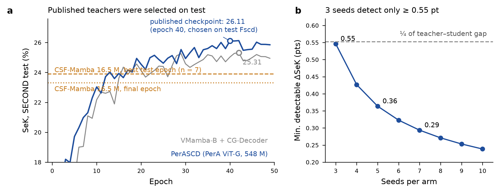
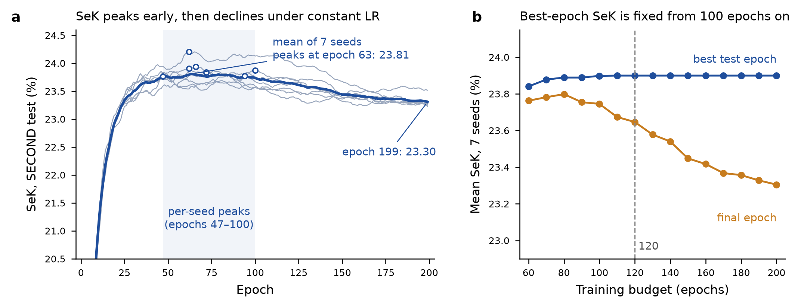

# Distillation PerASCD → CSF-Mamba — état des lieux et plan

Rédigé le 25 septembre 2026, **avant toute ligne de code**. Même méthode que
`landsat-scd.md` et `hybride.md` : ce qui a été vérifié, ce qui ne l'a pas été,
le plan chiffré, et les critères de lecture fixés d'avance.

Unités : SeK en **points de pourcentage** (26,11 = 0,2611 dans le reste du dépôt).

---

## 1. Ce que dit le dépôt, et où la note de cadrage est en retard

La note de cadrage (texte collé le 25 septembre) décrit une version antérieure du
modèle. Le code et le README du 11 septembre font foi :

| Note de cadrage | Dépôt (`main`, commit `ab8b1fe`) | Conséquence pour la distillation |
|---|---|---|
| VMamba-Tiny **tronqué à 3 étages** (1/4, 1/8, 1/16) | `out_indices=(0,1,2,3)` : **4 étages**, canaux 96/192/384/768, aucune trace de troncature ni de l'ablation « −59 % » | l'échelle 1/32 existe → distillation de features possible aux 4 échelles |
| C²S², FFT, CGA au cœur du modèle | C²S² **retiré** du point d'efficience (`fusion=concat`) ; FFT et CGA non détectables | l'élève est essentiellement *VMamba-mini + décodeur DySample partagé* |
| Loss CE + mIoU + terme SeK + L_sc | terme SeK **retiré** (+1,25 pt, résultat principal du stage) | ne pas le réintroduire via la KD |
| ~15–22 M | **16,48 M / 31,42 GMACs** (efficience, `mini`) ou **32,58 M / 58,06 GMACs** (performance, `tiny` + supervision profonde) | choisir l'élève (question Q3) |
| Calcul sur Vulcan, estimations en « GPU-heures A100 », compatibilité « avec Narval » | le code cible Narval (`def-hervete`, `gpu:a100`), environnement `$SCRATCH/csf-venv-cu12` | **décision du 25 septembre : ce projet reste sur Narval.** Scripts et environnement existants réutilisables tels quels ; heures directement en A100 |
| — | SeK élève : **23,90 ± 0,15** (meilleure époque test, n=7) ; **23,30** (époque finale) | écart au professeur : **2,2 pt** (efficience), 1,3 pt (performance) |

**Tranché le 25 septembre (Q5)** : l'élève « 3 étages » n'existe nulle part — ni dans
les 139 commits locaux, ni sur Narval (clone unique `~/csf-mamba` à `ab8b1fe`, aucune
modification non commitée, aucun stash, `out_indices=(0, 1, 2, 3)`). **L'élève a 4 étages.**

---

## 2. Vérifications faites sur le professeur

Sources : branches `legacy` (`a4d808a`) et `master` (`dfdcc1e`) de
`github.com/SathShen/PerASCD`, dépôt HF `SathShen/PerASCD-Checkpoint`, dépôt
`github.com/SathShen/PerA`. **Aucun poids téléchargé** : seuls le répertoire des zip
(requêtes HTTP partielles) et les journaux TensorBoard (30 Mo) ont été lus.

### Vérifié

| Point | Résultat |
|---|---|
| Branche | Il n'y a pas de `main` : les branches sont **`master`** (refactorisée) et **`legacy`** (reproduction du papier). |
| Checkpoint SECOND | Publié : `PerAChain_40e_mIoU74.33_Sek26.11_Fscd66.41_OA88.70.pth`, **4 386 Mo** (poids + moment SGD), dans un zip HF de 4,1 Go, avec son journal TensorBoard. Aussi sur BaiduDisk. |
| Checkpoint LandsatSCD | **Non publié.** Distiller sur Landsat-SCD suppose de réentraîner le professeur. |
| Second professeur publié | `vmambaB_42e_…_Sek25.31_Fscd65.61…pth` (905 Mo) : VMamba-B + CG-Decoder, SECOND. |
| Taille réelle | **548,17 M paramètres** (comptés sur le code `legacy` instancié sur `meta`) : blocs ViT 503,85 M, interactions ViT-Adapter 27,71 M, décodeur 9,04 M. Pas ~300 M. Rapport élève/professeur : **33×** (efficience). |
| Architecture | « ViT-G/16/1024 » = largeur 1024, **profondeur 40**, 16 têtes, MLP ×4 (pas un ViT-g DINOv2 de largeur 1536). |
| Contrat encodeur (legacy) | 4 sorties **toutes à 1024 canaux** (`CascadeGatedDecoder([1024]*4, 128, …)`), pas [128, 256, 512, 1024] — cette liste est le gabarit générique de `master`. |
| **448 / 512** | Le code `legacy` ne redimensionne pas l'image : `input_size=448` fixe seulement la grille de l'embedding positionnel, **interpolée en bicubique** à la taille réelle. Le professeur traite donc **nativement du 512** : grilles 128/64/32/16, **identiques à celles de l'élève**. Le problème d'interpolation annoncé disparaît. |
| Sélection du checkpoint | Le « val loader » lit **`test`** et sauvegarde sur le **meilleur Fscd**. Même pratique que ChangeMamba et que nous, mais sur une autre métrique. |
| Biais de sélection du professeur | Mesuré sur son journal : SeK 26,11 à l'époque 40 (max Fscd), max 26,13 (époque 42), **finale 25,85**, moyenne des 10 dernières 25,85 ± 0,25. Optimisme ≈ **+0,26 pt**. Une seule graine (3701). |
| Recette du professeur | SGD lr 0,1, momentum 0,9, poly 1,5, warmup 10 %, 50 époques, batch 4 × accumulation 2, fp16 autocast, clip 1,5, drop-path 0,3. Augmentations : flip/rot D4 **et** jitter (b 0,2, c 0,2, s 0,1, h 0,1). 742 itérations/époque → **les 2 968 paires de train** (pas de split de validation). |
| Loss | CE `ignore_index=0` sur A et B (×0,5) + BCE pondérée sur le changement + SSCLoss sur les canaux 1..6. |
| Classes | 7 canaux, 0 = « non-changé ». Le canal 0 **n'est jamais une cible** de la CE → à exclure de toute KL. |
| Normalisation | PerA (0,3585, 0,3741, 0,3155) / (0,1483, 0,1283, 0,1198), bien dans `legacy` (`DataPerAAUG`). |
| Code de métrique | `SCDD_eval_from_hist` (legacy) et `csf_mamba/evaluation/metrics.py` implémentent **la même formule** (histogramme global, κ sur `hist_n0`, SeK = κ·e^(IoU_fg−1)). Le `mIoU` rapporté est le mIoU **binaire** changé/non-changé. |
| Licences | Code PerASCD : MIT. Code PerA : MIT. |
| Poids PerA pré-entraînés | Publiés (ViT-G/16-1024) sur **Google Drive et Baidu**, pas sur HF. Papier PerA : doi 10.1080/10095020.2026.2628435. |
| Données du professeur | `SECONDbi.zip` (3,78 Go) et `LandsatSCD512.zip` (1,61 Go) sur HF `SathShen/PerASCD-datasets`. |



*(a) SeK test par époque, relu dans les journaux TensorBoard publiés ; cercle = checkpoint publié (meilleur Fscd test). En orange, l'élève d'efficience (moyenne n = 7). (b) Plus petit écart de SeK détectable entre deux bras (test t bilatéral, α = 0,05, puissance 0,8, σ = 0,18 pt, σ mis en commun du projet).*

### Non vérifié

1. **Licence des poids.** Aucune carte de modèle sur HF, aucune mention de licence pour les poids PerA (Google Drive) ni pour le corpus RSRSD-5m. La licence MIT du code ne couvre pas explicitement les poids. Pour publier un élève distillé, écrire aux auteurs (`shenht@whu.edu.cn`) est la voie propre.
2. **Compilation de `MultiScaleDeformableAttention` sur Narval** (A100, sm_80, torch 2.5.1 cu12 de `setup_env.sh`, module `cuda/12.2`). `legacy` épingle torch 2.8 + cu129 + xformers 0.0.32 ; xformers est facultatif (repli explicite). Le noyau dispose d'une implémentation PyTorch de référence qui suffit à l'évaluation si la compilation échoue. Environnement séparé de `csf-venv-cu12`, pour ne pas toucher celui de l'élève.
3. **Identité SECONDbi ↔ notre SECOND** (version prétraitée ChangeMamba). Même split officiel très probable (2 968 / 1 694), codage des labels à comparer pixel à pixel.
4. **Reproduction du 26,11** : non faite (aucun calcul GPU lancé).
5. **Paramètres du professeur VMamba-B** : ~113 M estimés à partir de la taille du checkpoint (poids + moment SGD = 8 octets/paramètre), non comptés.
6. **Débit professeur sur A100 40 Go** : ~35 ms/paire estimées, non mesurées ; mémoire en inférence (1,1 Go de poids en demi-précision) sans risque, mais à confirmer pour la KD de features en ligne (professeur + élève sur la même carte).
7. **Accès SSH depuis Claude Science** : Narval exige aussi Duo ; les jobs restent lancés par toi.
8. ~~Checkpoints de l'élève sur Narval~~ → **vérifié le 25 septembre**, voir §2bis.

---

## 2bis. État de Narval (audit du 25 septembre, `scripts/narval_audit.sh`)

**Les 7 graines du point d'efficience sont intactes.** Dossiers
`$SCRATCH/csf-mamba-runs/second_mini_chess_crop512-lean-augswap-ema-s{1,2,3,4,5,6,42}` :
200 époques chacune, `best.pt` (66 Mo) et `last.pt` (264 Mo). SeK à l'époque 199 :
moyenne **0,23305 ± 0,0010** (n = 7), identique au 0,2330 du README. Aucune liste de
purge à mon nom.

| Point | Constat | Conséquence |
|---|---|---|
| Date d'accès des `.pt` | 8–10 septembre | purge du scratch (~60 jours sans accès, règle Alliance) **vers début novembre** : archiver maintenant |
| `config.txt` | **absent** des 7 dossiers : lancés avant le garde-fou (`cc37672`, 10 sept. 21 h) | configuration exacte à reconstituer depuis les lignes `== config` des logs Slurm, avant de coder la KD |
| `$SCRATCH/SECOND` | format ChangeMamba (`T1 T2 GT_T1 GT_T2 GT_CD`, 2 968 / 1 694) | le professeur attend `im1 im2 label1 label2` : adaptateur de chargement ou liens symboliques pour l'étape 0 |
| Environnement `csf-venv-cu12` | torch 2.5.1, mamba_ssm 2.2.4, causal_conv1d 1.5.0.post8, selective_scan 0.0.2, **transformers 5.14.1, triton 3.6.0** | fonctionne (≈150 runs) grâce au correctif de `setup_env.sh`, mais ne pas y installer le professeur : environnement séparé |
| Quotas | `/home` 6,2/50 Go ; `/scratch` 169 Go/20 To ; `/project def-hervete` 53 Go/1 To mais **475 k/500 k fichiers (95 %, quota de groupe)** ; nearline `def-hervete` et `aip-hervete` vides (1 To chacun) | archiver en **une seule archive tar**, jamais en fichiers dépliés sur `/project` ; le cache du professeur (≈10 Go) va sur `/scratch` en un seul fichier (npz/HDF5 ou tar) |
| Archives existantes | `~/csf-checkpoints-20260819.tar` (4,9 Go) et `~/csf-archive-20260819.tar.gz` (89 Mo) | antérieures aux 7 graines de septembre : elles ne les couvrent pas |

**Marge GPU.** `def-hervete` est une allocation par défaut, **sans plafond d'heures**
(`GrpTRESMins` vide) : la contrainte est la priorité, pas un solde.

- Groupe `def-hervete_gpu` : **LevelFS 2,86** (> 1, le groupe consomme moins que sa part : bonne priorité).
- Toi, dans le groupe : 85 % de sa consommation effective (LevelFS 0,20). Cela ne pèse que sur l'arbitrage entre membres du groupe.
- Consommation depuis juillet (`sacct`) : 135 GPU-h (juillet), 1 007 (août), 763 (septembre) ; **1 905 GPU-h au total**. Au rythme d'août–septembre (≈32 GPU-h/jour : 1 770 GPU-h en 56 jours), le plan à 120 époques (≈255 A100-h) représente **environ 8 jours** de calcul (≈435 A100-h, deux semaines, à 200 époques).

**Limites d'ordonnancement.** Un job GPU dure **24 h au plus** (`gpubase_bygpu_b3`) ;
≤ 12 h ouvre aussi les partitions `b2`, ≤ 3 h les `b1`. À 200 époques, un run élève (12,8 h) et un run
KD de features en ligne (~18 h) tiendraient sous 24 h ; à 120 époques (adopté), tous passent sous 12 h — mais un nœud lent peut faire dépasser (cf.
`max-s6`, 3,3× trop lent) : la reprise automatique (`last.pt`, `resubmit.sh`) reste
indispensable. Des tranches MIG A100 (`a100_3g.20gb`, `a100_4g.20gb`, …) existent :
utiles pour l'évaluation du professeur et la génération du cache, si 20 Go suffisent.

### La baseline, relue dans ses `metrics.csv` (26 septembre)

**Configuration exacte**, reconstituée depuis les lignes `== config` des logs Slurm
(identique pour les 7 graines, seule la graine change) :

```
weight=1 dice=0 lovasz=0 crop=512 batch=2 x accum=4 enc=vmamba_mini dec=dw
fusion=concat cga=1 mcasf=1 up=dysample core=chess deep=0 sek=0 sc=0.1 fft=[0,1]
lr=constant rot90=1 photo=0.2 tswap=0.5 ema=0.9998 epochs=200   seeds 1 2 3 4 5 6 42
```

À retenir pour la KD : **la branche FFT est active** (`fft=[0,1]`), les rotations
90° aussi (`rot90=1` → groupe D4 complet, d'où les 8 variantes du cache), et le
micro-batch vaut **2** (batch effectif 8) — le professeur en ligne traitera donc 2
paires par passe.

| | max SeK test (époque) | SeK époque finale | SeK au max Fscd |
|---|---:|---:|---:|
| moyenne ± σ, n = 7 | **23,90 ± 0,15** (47–100) | **23,31 ± 0,10** | 23,90 ± 0,15 |



*(a) SeK test par époque des 7 graines (gris) et leur moyenne (bleu) ; cercles = meilleure époque de chaque graine. (b) Moyenne sur 7 graines du SeK à la meilleure époque et à la dernière époque, si l'entraînement s'arrêtait après E époques (préfixes des mêmes courbes).*

Trois constats, dont un corrige le journal :

1. **L'écart max – finale n'est pas du bruit de sélection, c'est un déclin.** Avec
   l'EMA, le bruit d'une époque à l'autre après l'époque 150 ne vaut que
   **0,03 pt** (σ des résidus d'une droite) : prendre un maximum sur une série
   aussi lisse ne rapporte que quelques centièmes. Or l'écart est de **0,60 pt**.
   La moyenne culmine à l'époque 63 (23,81) puis **décroît de 0,45 pt par
   100 époques** (±0,21) sous LR constant. Le journal (11 septembre) attribuait
   l'essentiel de l'écart au « maximum d'une série bruitée » avec un bruit de
   0,18 pt : c'était vrai sans EMA, plus avec.
2. **Choisir l'époque sur le Fscd ou sur le SeK ne change rien** : 23,895 contre
   23,899. Même constat chez le professeur (26,11 contre 26,13). La règle n° 1
   (« ne pas mélanger Fscd et SeK ») est satisfaite à 0,02 pt près des deux côtés.
3. **Un chiffre sans sélection sur le test existe.** Époque fixée à l'avance par
   validation croisée entre graines (pic de la moyenne des 6 autres, soit l'époque
   63, 64 ou 79) : **23,77 ± 0,17**. C'est 0,13 pt sous le maximum — bien moins que
   l'écart « maximum – finale » ne le laissait craindre.

**Conséquence pour la KD : la distillation régularise souvent, et ici la
régularisation se verrait surtout sur l'époque finale.** Si la KD freine le déclin
sans relever le pic, elle gagnera beaucoup sur la finale et peu sur le maximum. La
règle du projet (« les deux métriques doivent concorder ») classerait alors un vrai
effet en « non établi ». Lecture fixée d'avance : gain sur le maximum = **meilleur
pic** ; gain sur la finale seule = **stabilité**, rapportée comme telle, sans être
présentée comme une amélioration du SeK.

### Budget de 120 époques au lieu de 200 — **adopté le 26 septembre**

Avec un LR constant, **rien dans l'entraînement ne dépend du nombre d'époques
prévu** (`total_iters` ne sert qu'au cosinus, vérifié dans `_make_scheduler`) : un
run de 120 époques est exactement le préfixe d'un run de 200, au non-déterminisme
GPU près. Les 7 graines de 200 époques **fournissent donc déjà la baseline à 120
époques**, sans rien relancer : maximum **23,90 ± 0,15** (inchangé, tous les pics
sont avant l'époque 100), finale 23,65 ± 0,22.

- Coût d'un run : 12,8 h → **7,7 h** ; KD de features en ligne ~10,8 h : **tout passe sous 12 h**, donc dans les partitions `b2` en plus de `b3`, avec une attente plus courte.
- Plan complet : ≈435 → **≈255 A100-h** ; chemin court ≈275 → **≈160 A100-h**.
- Règle n° 3 respectée : KD et baseline au même budget (120).
- Garde-fou : si une graine KD culmine après l'époque 100, sa configuration est prolongée à 200 époques par reprise sur `last.pt` (possible précisément parce que le LR est constant ; il faudra alors autoriser le changement d'`epochs` dans l'empreinte `config.txt`).

## 3. Protocole unifié

**Décisions du 25 septembre** : chantier **parallèle** à `robustcd`, **sur Narval** (A100, `def-hervete`) ; **sélection

**Décisions du 26 septembre** : budget de **120 époques** (§2bis) ; criblage sur val puis confirmation sur test (ci-dessous) ; pas d'échéance ni de revue visée — le critère est la solidité, donc le **plan complet** plutôt que le chemin court.
d'époque sur le test conservée** (convention du projet, du 11 septembre) ; élève =
**point d'efficience** (16,48 M) ; professeur = **checkpoint PerASCD publié** seul.

| Élément | Choix | Justification |
|---|---|---|
| Split | split officiel : train 2 968 / test 1 694 | continuité avec les 7 graines existantes et avec le professeur (entraîné sur les mêmes 2 968) |
| Sélection d'époque | **meilleur SeK test**, poids EMA ; **époque finale** et **époque fixée d'avance** rapportées systématiquement | convention du projet ; la double métrique (phase 12, « C3 ») reste le garde-fou |
| Résolution | tuile entière 512, entraînement et évaluation, pour tous | le professeur est nativement en 512 (§2) |
| Code de métrique | `csf_mamba/evaluation/metrics.py` pour tous, professeur compris | formule identique vérifiée ; on l'exécute quand même sur le professeur |
| Budget | **120 époques**, LR constant, recette d'efficience, **identique avec et sans KD** ; baseline = préfixe des 7 runs de 200 époques | règle n° 3 ; §2bis |
| Graines | **5** pour les bras de conclusion, **2** pour le criblage | 3 graines ne détectent qu'un Δ ≥ 0,55 pt (fig. b) ; 5 → 0,36 pt |
| Tests | variance mise en commun **et** Welch, sur **les deux** métriques | règle du projet (phase 7) |

**Fscd contre SeK chez le professeur : l'écart est négligeable, et mesuré.** Son
checkpoint a été choisi sur le Fscd du test ; selon notre critère (max SeK test) il
vaudrait **26,13** au lieu de 26,11 (époque 42, journal publié). On rapporte
26,11 (le checkpoint qui existe), avec la note « +0,02 sous notre critère ; 25,85 en
fin d'entraînement ». La règle n° 1 tient à 0,02 pt près.

### ⚠️ Le risque que cette décision laisse ouvert, et une parade qui la respecte

Chaque balayage de KD (λ, T, masque, échelles) ajoute une **sélection entre
configurations** au-dessus de la sélection d'époque. Choisir λ sur le test, c'est
régler un hyperparamètre sur le test ; avec 12 configurations criblées, le gain de
KD serait gonflé d'un biais que la colonne « époque finale » ne capte pas (elle
corrige l'époque, pas la configuration).

Parade **retenue le 26 septembre**, sans changer la convention des chiffres rapportés :

1. **criblage** (étapes 2–4, 2 graines) entraîné sur 2 671 et jugé sur les 297
   paires de val du split `robustcd` (blake2b `robustcd-second-val-v1`) — le test
   n'est jamais regardé pour choisir λ, T, masque ou échelles ;
2. **confirmation** (étape 5) : la configuration choisie est réentraînée sur les
   2 968 paires, 5 graines, et rapportée selon la convention (max SeK test + finale).

Coût : aucun run supplémentaire (le criblage a lieu de toute façon).

**Pourquoi, en termes simples.** Ce n'est pas une question propre à la
distillation, c'est celle de tout réglage d'hyperparamètres. Si l'on essaie
12 réglages et qu'on garde celui qui fait le meilleur score *sur le test*, une
partie de son avance vient de la chance de ce réglage-là sur ces 1 694 images
précises : le test a servi à choisir, il ne mesure plus de façon neutre. Avec des
écarts attendus de quelques dixièmes de point et un bruit entre graines de
0,15 pt, cette part de chance n'est pas négligeable. Choisir sur 297 images que
le modèle final ne verra jamais à l'évaluation, puis mesurer **une seule fois**
sur le test, supprime ce biais pour le prix d'un léger bruit supplémentaire au
criblage.

Split utilisé : `robustcd/splits/SECOND/{train,val}.txt` (2 671 / 297 identifiants,
sha256 `b3fec730…` et `87306dcb…`, ratio de changement 0,200 / 0,193), à copier
tel quel dans `csf-mamba/splits/SECOND/` pour que les deux projets partagent le
même découpage.

---

## 4. Plan de travail

Coût d'un run élève à **120 époques**, **mesuré sur la vague 1 (27 sept.)** : **4,7–5,1 h A100** en criblage
(2 671 paires, val de 297 : ≈135–143 s d'entraînement + 8 s de val par époque) ; **KD en cache : aucun surcoût
mesurable**. Confirmation (2 968 paires, val = test de 1 694) : ≈154 s + ≈40 s par époque → **≈6,5 h** (estimé).
KD de features en ligne : le professeur fp16 passe 16,3 paires/s (étape 0, lot de 8) → ≈+165 s par époque de
2 671 paires, soit **≈10,5–11,5 h** par run de criblage — près du walltime de 12 h (reprise automatique sur
`last.pt`, ou `--time=24:00:00`). Professeur en avant seul : **1,51 TMAC** par paire (mesuré, étape 0).
*(Les chiffres 7,7 h / 6,9 h / +5 % / +40 % des versions précédentes de ce paragraphe étaient des estimations
antérieures aux mesures ; les colonnes A100-h du tableau ci-dessous sont donc des majorants pour les étapes 1–3.)*

| Étape | Objectif | Livrable | Critère de réussite | A100-h |
|---|---|---|---|---:|
| **P** | Vérifier l'existant sur Narval | `git pull`, `tests/`, un checkpoint d'efficience réévalué ; `--account=def-hervete`, `gpu:a100` inchangés | SeK réévalué à ±1e-4 de la valeur du journal | 1 |
| **0** | Reproduire le professeur sous notre protocole | env `legacy` séparé + op compilée, éval test fp32/fp16/bf16, code legacy **et** le nôtre, params/GMACs/latence ; comparaison des labels SECONDbi / notre SECOND | SeK **26,11 ± 0,05**, Fscd 66,41 ± 0,05 ; écart entre les deux codes < 1e-4 ; labels identiques ou différence documentée | 2 |
| 0-cache | Cache des sorties du professeur | logits à 1/4 (128², canaux 1..6 de A et B + changement), 8 variantes D4, fp16, sur les 2 968 paires | cache relu = sortie en ligne à la précision fp16 près | 1 |
| **1** | Élève sans KD | **les 7 graines Narval existantes**, tronquées à 120 époques (max 23,90 ± 0,15 ; finale 23,65 ± 0,22) + 2 graines sur 2 671 (témoin du criblage, 120 époques) | le chemin sans KD du code modifié reste identique à l'octet près (test à la manière de `tests/test_hybride.py`) | 14 |
| **2** | KD du **changement** seul (cache) | BCE à cibles douces, λ ∈ {0,5 ; 1 ; 2} × 2 graines, criblage sur val | Δ ≥ +0,36 pt contre le témoin sur val | 44 |
| **3** | + KD **sémantique** (cache) | KL sur canaux 1..6, T ∈ {2 ; 4} × masque {changé GT ∪ professeur ; toute l'image}, 2 graines | incrément ≥ +0,36 pt sur l'étape 2, sur val | 58 |
| **4** | + KD de **features** (en ligne) | adaptateurs 1×1 élève → 1024, cosinus après LayerNorm ; {1/8+1/16} vs {1/8+1/16+1/32}, 2 graines | incrément ≥ +0,36 pt sur l'étape 3, sur val, sinon non retenu | 50 |
| **5** | Confirmation, convention du projet | meilleure KD logits seuls et meilleure KD logits+features, **5 graines chacune sur 2 968, 120 époques**, max SeK test + finale ; params, GMACs, latence fp32/bf16 sur A100, **mêmes conditions que la latence du README** (lot de 8, 512², médiane sur 50) | fraction d'écart comblée (S_KD − S_1)/(S_prof − S_1) avec IC 95 %, les deux tests et les deux métriques concordants | 110 |
| **Total** | | | | **≈ 250** (durées `sacct` de septembre : ≈3,4 min/époque) |

**Chemin court (~160 A100-h).** λ = 1 sans balayage à l'étape 2, un seul masque à
l'étape 3 (toute l'image, le plus informatif), une seule variante de features. On
perd la courbe de sensibilité, pas la conclusion principale.

*Non retenus le 25 septembre* : réentraînement du professeur (36–60 A100-h) et
professeur VMamba-B publié (coût marginal, test de l'écart de capacité). Ce
dernier reste la première option à rouvrir si la KD du 548 M déçoit (risque 9).

### Pourquoi cet ordre

Le journal a établi que **la localisation du changement est le goulot** (IoU de
changement 0,58 ; la sémantique conditionnelle au changement est déjà bonne). La KD
du changement vise ce goulot, elle est supervisée partout (la carte binaire existe
sur toute l'image), et elle est la moins chère. Si elle ne rapporte rien, les étapes
suivantes deviennent douteuses — c'est une porte de décision.

### Hors ligne ou en ligne — chiffré

| Cible | Taille par paire (fp16) | 2 968 × 8 D4 | Coût en ligne par run |
|---|---:|---:|---:|
| Logits à 1/4 (13 canaux, 128²) | 0,43 Mo | **10,2 Go** | ≈ +5 h A100 |
| Logits à 512 (inutile : le professeur suréchantillonne en bilinéaire depuis 1/4) | 6,8 Mo | 162 Go | — |
| Features encodeur, 4 échelles × 1024 canaux × 2 dates | 89 Mo | 2,1 To | ≈ +5 h A100 |

Générer le cache coûte ~15 min de GPU. **Logits : hors ligne. Features : en ligne**
(≈ +110 % sur un run de criblage d'après les mesures : ≈10,5–11,5 h au lieu de ≈4,9 h ; cf. §4).

- **D4** : 8 variantes pré-calculées → cohérence exacte, pas seulement approchée.
- **Échange temporel** : échanger predA ↔ predB du cache ; le changement est symétrique. Exact.
- **Jitter photométrique** : le professeur voit la vue propre, l'élève la vue altérée. Ce n'est pas un défaut à contourner : c'est une contrainte d'invariance radiométrique, et PerASCD revendique précisément cette robustesse. Cela reste une différence avec la KD « cohérente » (Beyer et al., 2022) : on l'isole par un bras jitter-off si l'étape 2 est positive.
- **Crop** : sans objet, tuile entière 512.

### La question des zones non-changées

Sur SECOND, ~80 % des pixels n'ont **aucune** supervision sémantique, ni pour
l'élève ni pour le professeur : ses prédictions y ont été façonnées par la seule
SSCLoss (cohérence A/B), pas par des étiquettes. C'est donc une extrapolation, pas
une connaissance vérifiée. Deux raisons de la tester quand même : elle multiplie
par ~5 les pixels porteurs de signal sémantique, et le SeK compte la sémantique de
tout pixel **prédit** changé — donc des faux positifs de l'élève en zone
non-changée. Le masque est un facteur explicite de l'étape 3. À noter : les auteurs
avaient écrit un pseudo-étiquetage des zones non-changées, **commenté** dans
`legacy/train.py` — signe qu'ils l'ont essayé sans le retenir.

---

## 4bis. Lancer les étapes P et 0 (code écrit le 26 septembre)

Fichiers : `scripts/check_narval.{py,sbatch}` (P), `scripts/teacher/setup_teacher.sh`,
`scripts/teacher/eval_perascd.{py,sbatch}` (0). Sorties dans
`$SCRATCH/csf-distill/{teacher,checks}/`.

```bash
# portable : commit + push, puis sur Narval (nœud de connexion)
cd ~/csf-mamba && git pull && mkdir -p logs
sbatch scripts/check_narval.sbatch                 # P  : ~1 h GPU
bash scripts/teacher/setup_teacher.sh              # 0a : clone, checkpoint 4,1 Go, venv (connexion)
sbatch scripts/teacher/eval_perascd.sbatch         # 0b : ~1 h GPU (compile l'op au 1er passage)
# retour (portable) : scp 'magron13@narval.alliancecan.ca:/scratch/magron13/csf-distill/checks/*.json' ~/Projects/csf-mamba/logs/
```

**Journal d'exécution.**

- 26 sept. : `setup_teacher.sh` OK sur Narval. PerASCD `legacy` @ `a4d808a` (2026-05-29, « init »). Checkpoint `PerAChain_40e_mIoU74.33_Sek26.11_Fscd66.41_OA88.70.pth`, 4 386 148 239 octets, sha256 `a820956553bf89bac4b48f60be4c0cbc1cc080998f4dc83a257777a403c0e4f5` (zip `6f6de82c…c35dea`). venv `$SCRATCH/perascd-venv` : torch 2.5.1 (CUDA 12.2), torchvision 0.20.1, timm 1.0.29, numpy 2.4.2, scipy 1.17.1. Jobs soumis : P = 4023058, 0b = 4023491.
- 26 sept., **étape P : PASS** (job 4023058, A100-SXM4-40GB, torch 2.5.1). Les 7 `best.pt` réévalués en bf16 retrouvent le SeK de leur `metrics.csv` à **4,1e-6 près au pire** (seed 2), sous l'arrondi du CSV (5e-6) : environnement, code et données inchangés depuis septembre. En fp32, écarts de −3,7e-5 à +9,7e-5 (moyenne +1,8e-5), soit ≤ 0,01 pt : la précision de validation ne biaise pas la sélection. 16 483 643 paramètres, comme le README. ~40 s par évaluation de 1 694 paires.
- 26 sept., **étape 0b, 1er essai (job 4023491) : arrêt au chargement.** L'opérateur `MultiScaleDeformableAttention` s'est compilé sans erreur (setuptools 82, sm_80). Le `load_state_dict(strict=True)` a refusé 6 clés : le checkpoint porte `decoder.blocks.{0,1,2}.cagm.conv2.*`, le code `legacy` construit `…cagm.conv_local.*`. Le dépôt contient deux copies de `ChangeAwareGatingModule` (`models/Encoders.py` : `conv2` ; `models/PerAChain.py` : `conv_local`) au calcul **identique ligne à ligne** et aux tenseurs de même forme — le checkpoint vient de la première. Correctif : renommage borné à ce motif, avec contrôle de forme, `strict=True` conservé, clés renommées listées dans le JSON. Vérifié localement : un state_dict renommé se recharge à l'identique (tous les tenseurs égaux). La reproduction du 26,11 validera le renommage de bout en bout : une erreur d'appariement effondrerait le score.
- 26 sept., **étape 0 : PASS** (job 4026049, A100-SXM4-40GB). Le checkpoint publié, réévalué sur **notre** SECOND test en fp32 :

  | | publié (journal TB) | notre réévaluation | écart |
  |---|---:|---:|---:|
  | SeK | 26,1087 | **26,1079** | −0,0008 pt |
  | Fscd | 66,4138 | **66,4104** | −0,0034 pt |
  | mIoU | 74,33 | 74,331 | — |

  - leur code et le nôtre (`SCDEvaluator` complet, alimenté par les sorties du professeur) concordent à **1e-8** ;
  - données : **0 pixel** où `GT_CD` ≠ (label T1 > 0), 0 où label T1 > 0 ≠ label T2 > 0 sur 444 M pixels ; ordre des classes identique (l'appariement optimal est l'identité, précision sémantique 88,6 % sur les pixels changés). Notre SECOND et leur SECONDbi sont équivalents pour l'évaluation : **télécharger SECONDbi est inutile** ;
  - opérateur déformable CUDA ↔ référence PyTorch : écart max 0,003 sur les logits, argmax identique à 99,9994 % ;
  - précision : SeK fp16 = 26,1082, bf16 = 26,1049 (≤ 0,003 pt du fp32) → **fp16 retenu** pour le cache et la KD en ligne ;
  - le renommage `cagm.conv2 → conv_local` est validé par la reproduction elle-même.

  **Coût du professeur, mesuré** (lot de 8, 512², médiane de 50, protocole du README ; élève : README, 10 sept.) :

  | | professeur | élève (efficience) | rapport |
  |---|---:|---:|---:|
  | Paramètres | 548,17 M | 16,48 M | 33× |
  | GMACs / paire | 1 509,7 ¹ | 31,42 ² | ≈48× |
  | Latence fp32 | 1 613 ms · 5,0 paires/s | 129 ms · 62 paires/s | 12,5× |
  | Latence bf16 | 563 ms · 14,2 paires/s | 114 ms · 70 paires/s | 4,9× |
  | Latence fp16 | 490 ms · 16,3 paires/s | — | — |
  | Mémoire crête | 27–28 Go | 1,9–2,0 Go | ≈14× |

  ¹ `torch.utils.flop_counter`, opérateur déformable non compté. ² compteur du projet (fvcore). Les deux compteurs diffèrent : recompter l'élève avec le même outil à l'étape 5 avant de publier le rapport.

  **Conséquence sur le budget.** Mon estimation de 1,3 TMAC était basse (1,51 mesuré). À 16,3 paires/s, le professeur en ligne ajoute ≈2,7 min par époque de 2 671 paires, soit **+80 %** et non +40 % : un run de KD de features passe à ≈12,4 h (2 671) / ≈13,8 h (2 968), donc en partition 24 h. Étapes 4 et 5 : +11 h et +15 h ; **plan complet ≈280 A100-h** au lieu de 255. Réserve : avec le micro-batch de 2 de l'élève, le débit du professeur peut être inférieur à celui mesuré en lot de 8 — à mesurer au premier run de l'étape 4.
- 26 sept. : split `robustcd` copié à l'octet près dans `splits/SECOND/` (2 671 / 297 / 1 694). Les sha256 de `README.json` portent sur `"\n".join(ids)` sans saut de ligne final (convention de `robustcd/scripts/check_dataset.py`), d'où leur différence avec `sha256sum` des fichiers — vérifié, les listes sont identiques.
- 26 sept. : `scripts/teacher/cache_teacher.{py,sbatch}` écrit. 8 fichiers `d4_{0..7}.npy` (2 968, 15, 128, 128) fp16, `ids.txt`, `meta.json`. Testé localement (CPU, ViT-B aléatoire) : la correspondance entre les transforms de l'élève (flips puis rot90) et l'index de cache est vérifiée sur 200 tirages de la vraie chaîne `csf_mamba.datasets.transforms`, et le suréchantillonnage du cache redonne exactement la sortie 512 (écart 0,0). Le job mesure aussi l'écart d'équivariance du professeur et son SeK sur le train depuis le cache relu.
- 26 sept., **cache : OK** (job 4027028, 26 min, 15,2 paires·vue/s). 8 × 1 458 831 488 octets = 2 968 × 15 × 128² × 2 o + en-tête : complet. Contrôles de `meta.json` :
  - SeK du professeur **sur le train**, relu depuis le cache fp16 : **33,24** (Fscd 71,50, mIoU 77,77) — au-dessus du test (26,11), loin de la saturation : les cibles douces ne recopient pas les étiquettes ;
  - **écart d'équivariance** : entre T(g·x) et g·T(x), la décision de changement diffère sur **2,2–2,5 % des pixels** et la classe sur 2,7–3,0 % des pixels changés. Rapporté aux ~20 % de pixels changés, c'est de l'ordre de 12 % de la zone changée : **les 8 vues sont justifiées**, un cache à vue unique aurait donné des cibles incohérentes avec les augmentations de l'élève ;
  - piste ouverte par ce chiffre, notée pour l'étape 3 : un professeur **moyenné sur D4** (« TTA ») est gratuit à partir de ce cache et probablement meilleur que chaque vue seule.
- 26 sept., **code des étapes 1–3** :
  - `SECONDDataset(ids_file=, image_split=)` : sous-ensembles lus dans `train/` (val = 297 ids) ; comportement inchangé sans ces arguments ;
  - les transforms enregistrent leurs tirages (hflip, vflip, k, swap, crop) **seulement** si l'échantillon porte la clé `_aug` — tirages aléatoires strictement identiques sinon (testé) ;
  - `csf_mamba/distill/d4.py` : convention D4 unique, désormais importée par le script de cache ;
  - `TeacherCacheDataset` : applique la chaîne d'augmentation, lit la vue D4 tirée, échange T1/T2 si l'échange temporel a été tiré, refuse tout crop partiel ;
  - `DistillLoss` : BCE douce sur le changement (T², entropie du professeur retranchée pour des logs lisibles) ; KL sur les classes 1..6 renormalisées, masque `changed` ou `all` ;
  - `train.py` : `--train-ids`, `--val-ids`, `--kd-cache`, `--lambda-kd-change`, `--kd-t-change`, `--lambda-kd-sem`, `--kd-t-sem`, `--kd-sem-mask` ; tout à 0 par défaut, garde-fous si λ > 0 sans cache ou cache sans λ ;
  - `scripts/train_kd_second.sbatch` : recette d'efficience figée (ligne `== config` des 7 graines), `MODE=screen|confirm`, empreinte `config.txt`, cache et SECOND copiés dans `$SLURM_TMPDIR`.
  - Tests (`tests/test_distill.py`, CPU) : transforms inchangés sans `_aug` ; sous-ensemble d'ids ; **alignement de bout en bout** avec un faux professeur « oracle » dans un cache au format réel — 200 tirages de la vraie chaîne (flips, rot90, jitter, échange) sans une erreur, et le témoin « toujours la vue 0 » échoue bien ; perte nulle et gradient nul quand l'élève reproduit le professeur. Les tests existants passent. Entraînement CPU de 2 époques avec KD : termes `kd_change` et `kd_sem` présents et sommés au total.
- 26 sept., **durée d'un run : tranchée par `sacct`.** Les 28 jobs `csf-second` des 7–8 septembre (lot de reprise, 200 époques, recette `lean` et variantes, validation sur le test à chaque époque) ont duré **11 h 04 à 11 h 30** pour la plupart (4 jobs à 12 h 36–12 h 43, sans doute les variantes à encodeur `tiny`), soit **≈3,4 min/époque**. Le « 7 h 45 pour 100 époques » de l'en-tête de `train_second.sbatch` datait d'une recette antérieure. Un run de 120 époques dure donc ≈6,8 h (2 968 paires) / ≈6,1 h (2 671, validation sur 297). Avec le professeur en ligne (+≈2,7 min/époque) : ≈11,6 h / ≈12,9 h. **Plan complet ≈250 A100-h.**
- 26 sept. : `/scratch` très lent dans la journée — un `tar` des 23 310 PNG de SECOND a pris 47 min 31 s (0,4 s de calcul : attente d'E/S), et le premier run d'essai (job 4030416) a épuisé son heure dans `cp -r`. Deuxième essai (job 4039676) : l'archive `SECOND_stage.tar`, qui listait 23 310 PNG juste après sa création, a été retrouvée **tronquée à 16 711 680 octets** (3 650 entrées, date de modification 6 s avant la soumission du job) ; l'extraction n'a rien produit d'utilisable et le chargement a échoué avant l'entraînement. Une coupure au niveau du système de fichiers est plausible ; intégrité des autres fichiers de `/scratch` à vérifier. **Staging désormais par `unzip` de `$SCRATCH/SECOND.zip`** (archive d'origine, 1 fichier, CRC vérifié par fichier), garde-fou 2 968 / 1 694 paires avant l'entraînement, temps journalisés. Ce même essai a montré que la copie du cache (12 Go) prend 35 s.
- 27 sept., **intégrité de `/scratch` vérifiée** : `unzip -tq SECOND.zip` sans erreur ; sha256 du checkpoint professeur identique au téléchargement (`a8209565…`) ; les 8 fichiers du cache, 64 lignes tirées chacun : tout fini, aucune ligne nulle, écart-type 3,86–3,89. Empreintes du cache écrites dans `cache/perascd_second_train/SHA256SUMS` (10 fichiers) pour les vérifications futures. L'archive tronquée reste le seul fichier touché ; supprimée.
- 27 sept., **essai de bout en bout réussi** (job 4089008, commit 459f225, `MODE=screen`, 2 époques, λ_chg = 1) : staging SECOND 30 s (2 968 / 1 694), cache 30 s ; 16 483 643 paramètres ; `kd_change` 0,53 → 0,12 sur les 2 époques, bien sommé au total. Val (297) après 2 époques : Fscd 0,274, mIoU 0,639 — dans la plage des 7 graines de référence au même stade (test : Fscd 0,21–0,27, mIoU 0,57–0,63) ; SeK ≈ 0 aux époques 0–1 comme chez elles (EMA en préchauffage). Le log ne donnait pas la durée d'une époque : `train.py` écrit désormais `timing.csv` (durée entraînement / validation, pic mémoire, par époque), sans toucher à `metrics.csv` ; vérifié en CPU, reprise comprise.
- 27 sept., **vague 1 (étapes 1–2, criblage) : 8/8 COMPLETED** (jobs 4091720–4091727, commit 2f8ece0, 2 671 train / 297 val, 333 pas d'optimiseur par époque). Durée 4 h 44 – 5 h 07 par run (≈135–143 s d'entraînement + 8 s de val par époque ; **aucun surcoût mesurable du cache KD**), pic mémoire GPU 4,2 Go. Analyse `scripts/analyze_screen.py` → `logs/screen_w1/analyse/`. SeK val (pt), moyenne de 2 graines, écart au témoin, p du test à variance poolée (σ poolé 0,40 sur le max, 0,21 sur la finale, df = 4) :

  | bras | max | Δ max | p | finale | Δ finale | p |
  |---|---:|---:|---:|---:|---:|---:|
  | témoin | 23,61 ± 0,30 | — | — | 23,25 | — | — |
  | λ_chg = 0,5 | 24,20 ± 0,54 | +0,59 | 0,22 | 24,01 | +0,76 | 0,022 |
  | λ_chg = 1 | 24,86 ± 0,46 | +1,25 | 0,035 | 24,66 | +1,41 | 0,003 |
  | λ_chg = 2 | 25,45 ± 0,21 | **+1,83** | 0,010 | 25,31 | **+2,06** | 0,001 |

  Réponse **monotone en λ** ; les trois bras passent le critère (+0,36 pt). Le témoin plafonne vers l'époque 60 puis décline ; les bras KD λ = 1 et 2 montent encore à l'époque 120 (max aux époques 91–119) ; à λ = 0,5, une graine culmine plus tôt (époques 119 et 75). En moyenne, l'écart au témoin grandit avec l'entraînement. **Deux réserves :** (1) le meilleur λ est au bord de la grille → prolonger à λ ∈ {4 ; 8} ; (2) le gain peut venir du seul ajout d'une BCE de poids λ sur le logit de changement, ou de cibles aux bords adoucis, plutôt que du savoir du professeur → **contrôles** `KD_TGT=gt` (vérité brute) et `KD_TGT=gt_smooth` (vérité moyennée à 128² puis suréchantillonnée comme le professeur), même λ = 2. Biais connu du criblage : le professeur a été entraîné sur les 2 968 paires, val comprise ; ses sorties sur les 2 671 images d'entraînement peuvent porter un peu de ce qu'il a appris sur la val, ce qui favorise légèrement la KD face aux contrôles **sur la val seulement** (le test, lui, est inconnu du professeur). Si `gt_smooth` arrive à moins de ~0,5 pt de la KD sur val, le contrôle entre dans la confirmation sur test.
- 27 sept., **revue avant la vague 2.**
  - **Non-régression du chemin sans KD (critère de l'étape 1) : vérifiée à l'octet près.** Même entraînement CPU (3 époques, seed 1, EMA, rot90, jitter, échange temporel, accumulation) avec le code d'avant la distillation (commit `ab8b1fe`) et le code actuel : logs de pertes, `metrics.csv`, `best.pt` (132 tenseurs), `last.pt` (modèle + EMA) **identiques** ; l'ancien code rejoué deux fois est lui-même reproductible. Limite : encodeur `conv` / backend `ref` sur CPU — les noyaux Mamba GPU ne sont pas touchés par les modifications.
  - **Appariement par graine confirmé** : à graine égale, les 4 bras de la vague 1 ont exactement la même perte au pas 0 (seed 1 : ce_bcd 0,6778, ce_sem 1,8326 ; seed 2 : 0,5492, 2,0659) — même initialisation, même premier lot, mêmes tirages d'augmentation. Écart λ = 2 − témoin par graine : +1,90 (s1) et +1,77 (s2) pt sur le max.
  - Aucun `nan`, aucune trace d'erreur, aucune reprise dans les 8 logs.
  - Le cache est indexé **par identifiant** (`ids.txt`), pas par position : le sous-ensemble 2 671 lit les bonnes lignes.
  - Seuil +0,36 pt : il avait été calculé pour 5 graines sur le **test** (σ 0,18) ; sur la val à 2 graines, σ poolé vaut 0,40. Au criblage c'est un seuil de tri, pas un test de conclusion.
- 28 sept., **vague 2 : 8/8 COMPLETED** (jobs 4110404–4110433, commit 51205c5 — seule la doc diffère de bf164d4 ; 4 h 50 – 4 h 55 par run, ≈39 A100-h). Logs propres (pas de `nan`, pas de reprise), `cible=` conforme, perte au pas 0 identique au témoin de même graine. Analyse jointe des 16 runs, un seul témoin : `logs/screen_w2/analyse_all/`. SeK val (pt), σ poolé 0,34 (max) / 0,35 (finale), df = 8 :

  | bras | max | Δ max | Δ par graine (s1 ; s2) | p | Δ finale | p |
  |---|---:|---:|---|---:|---:|---:|
  | témoin | 23,61 | — | — | — | — | — |
  | contrôle `gt`, λ = 2 | 23,65 | +0,04 | +0,20 ; −0,13 | 0,92 | −0,48 | 0,21 |
  | contrôle `gt_smooth`, λ = 2 | 23,59 | −0,02 | +0,20 ; −0,24 | 0,95 | −0,19 | 0,59 |
  | KD λ = 0,5 | 24,20 | +0,59 | +0,41 ; +0,76 | 0,12 | +0,76 | 0,06 |
  | KD λ = 1 | 24,86 | +1,25 | +1,14 ; +1,36 | 0,006 | +1,41 | 0,004 |
  | KD λ = 2 | 25,45 | +1,83 | +1,90 ; +1,77 | 0,001 | +2,06 | < 0,001 |
  | KD λ = 4 | 25,53 | +1,92 | +1,89 ; +1,95 | < 0,001 | +2,23 | < 0,001 |
  | KD λ = 8 | **25,95** | **+2,33** | +2,83 ; +1,84 | < 0,001 | **+2,53** | < 0,001 |

  **Lecture.** (1) **Les deux contrôles n'apportent rien** : ni une BCE supplémentaire de poids 2 sur la vérité, ni des cibles aux bords adoucis comme celles du professeur. Ils accélèrent le début (≈ +0,5 pt vers l'époque 15–20) puis passent sous le témoin après l'époque 50 : même surapprentissage tardif que lui. **Le gain vient donc du contenu des cibles du professeur**, pas de la forme ni du poids de la perte. Le biais « le professeur a vu la val » ne peut pas expliquer un écart de ≈ 1,9 pt entre KD et contrôles au même λ, mais la confirmation sur test reste nécessaire. (2) **Plateau probable à partir de λ = 2** : 1,83 / 1,92 / 2,33 pour λ = 2 / 4 / 8, écarts entre eux dans le bruit (erreur-type d'une moyenne de bras ≈ 0,24) ; λ = 8 a la meilleure moyenne mais la plus grande dispersion entre graines. (3) Avec KD, SeK finale ≈ max : la KD supprime le déclin tardif du témoin.

  **Décision (règle du criblage : meilleur max moyen sur val) : λ_chg = 8** comme base de l'étape 3. λ = 16 ajouté à la vague 3 pour savoir si le plateau est atteint (le meilleur λ est encore au bord de la grille).
- 28 sept., **vague 3 (étape 3 + λ = 16) : 10/10 COMPLETED** (jobs 4150297–4150307, commit 8de169a — doc seule depuis bf164d4 ; 4 h 49 – 4 h 54 par run, ≈48 A100-h). Logs propres, `Distillation :` conforme à chaque config, pas 0 identique au témoin de même graine. Analyse des 26 runs : `python scripts/analyze_screen.py logs/screen_w{1,2,3}/runs --compare-to kdchg-l8 --out logs/screen_w3/analyse_all` (le script accepte désormais plusieurs dossiers et un second repère). σ poolé 0,29 (max), df = 13. SeK val max (pt), incrément contre λ_chg = 8 seul (25,95) :

  | bras | max | Δ vs témoin | incrément vs λ_chg = 8 (s1 ; s2) | p | incr. finale | p |
  |---|---:|---:|---|---:|---:|---:|
  | λ_chg = 16 | 25,88 | +2,26 | −0,07 (−0,35 ; +0,21) | 0,81 | +0,03 | 0,91 |
  | + sém. T = 2, masque changé | 26,70 | +3,09 | +0,75 (+0,38 ; +1,12) | 0,021 | +0,90 | 0,008 |
  | + sém. T = 2, toute l'image | **26,75** | **+3,13** | **+0,80** (+0,56 ; +1,04) | 0,015 | +0,87 | 0,010 |
  | + sém. T = 4, masque changé | 26,46 | +2,85 | +0,51 (+0,45 ; +0,58) | 0,095 | +0,67 | 0,038 |
  | + sém. T = 4, toute l'image | 26,40 | +2,79 | +0,45 (+0,04 ; +0,86) | 0,14 | +0,50 | 0,11 |

  **Lecture.** (1) **Plateau de λ_chg confirmé** : 16 ≈ 8 (−0,07 pt, écart entre graines de 16 : 0,01 pt). (2) **La KD sémantique ajoute ≈ +0,8 pt à T = 2** (critère +0,36 franchi pour les deux masques, les deux graines positives, sur max et finale) ; T = 4 fait moins bien (+0,45–0,51). (3) **Masque changé ≈ toute l'image** à T = 2 (0,05 pt d'écart, dans le bruit) : inclure les zones non-changées, où le professeur n'a jamais été supervisé en sémantique, ne nuit pas. Fscd suit : 66,29 (tout) / 66,44 (changé) contre 65,49 pour λ_chg = 8 seul. (4) Rien ne plafonne encore à 120 époques (max aux époques 91–119).

  **Décision (même règle) : configuration « KD logits » = λ_chg = 8, λ_sem = 1, T_sem = 2, masque `all`.** À noter pour l'article : `changed` est équivalent sur la val ; le choix est dicté par la règle pré-enregistrée, pas par un écart significatif.

  **Ordre retenu (28 sept.)** : confirmation sur test de la KD logits **tout de suite** (10 runs `MODE=confirm`, graines 1–5 : `kdchg-l8` pour l'ablation et `kdlogits` = config retenue), code de l'étape 4 écrit pendant qu'ils tournent ; la config features, si elle est retenue, sera confirmée dans une vague à part. Analyse : `scripts/analyze_confirm.py` (baseline = 7 graines de référence tronquées à 120 époques ; Welch, apparié sur les graines communes, IC 95 %, fraction d'écart comblée avec le professeur à 26,1079 sous notre protocole). Vérifié sur la baseline réelle : 23,899 ± 0,149 (max), 23,646 ± 0,218 (finale).

- 28 sept., **code de l'étape 4 (KD de features, professeur en ligne)** :
  - `csf_mamba/distill/online_teacher.py` : `OnlineTeacherEncoder`, encodeur seul du professeur (DINOv2 ViT-G/16 + ViT-Adapter, décodeur jeté), même chargement que l'étape 0 (strict, renommage `cagm`), autocast fp16, normalisation PerA appliquée aux images **augmentées de l'élève** (aucune correspondance de vue à gérer), deux dates en un passage, toujours en `eval`.
  - `FeatureDistillLoss` (`csf_mamba/losses/distill.py`) : adaptateur 1×1 par étage (hors modèle : l'élève garde 16,48 M paramètres ; groupe d'optimiseur à part ; sauvé dans `last.pt`), 1 − cos après LayerNorm sans paramètres sur les canaux, moyenne sur étages × dates.
  - `CSFMamba.return_encoder_feats` (défaut False) expose les 4 étages de l'encodeur ; `train.py` : `--lambda-kd-feat`, `--kd-feat-stages`, `--teacher-root`, `--teacher-ckpt`, `--teacher-arch`, `--teacher-msda` ; sbatch : `LKD_FEAT`, `KD_FEAT_STAGES`, MSDA compilé dans le job (dossier local, venv partagé intact).
  - Tests CPU (`tests/test_distill_feat.py`) : perte nulle quand le professeur égale la sortie de l'adaptateur, invariante à échelle/biais du professeur, ≈ 1 pour des features indépendantes, gradients vers l'élève et les adaptateurs, pas vers les étages non distillés ; drapeau du modèle sans effet sur les autres sorties ; professeur ViT-B aléatoire : 4 échelles aux tailles de l'élève, fp16, sans gradient. Entraînement CPU de bout en bout (logits + features, 2 époques, puis reprise) : `kd_feat` présent et sommé.
  - **Non-régression refaite après ces modifications** : entraînement sans KD toujours identique à l'octet près au commit `ab8b1fe` (logs, `metrics.csv`, `best.pt`, `last.pt`).
  - Reste à mesurer sur Narval (essai de 2 époques) : compilation MSDA dans le venv de l'élève, durée d'une époque, mémoire avec ViT-G + élève sur A100 40 Go.
- 28 sept., **essai de bout en bout de la KD de features** (job 4176343, commit 4ff0e36, criblage, 2 époques, logits retenus + features aux étages 1/8, 1/16, 1/32, λ_feat = 1) : MSDA compilé dans le venv de l'élève (**717 s**) ; professeur chargé strictement (6 clés `cagm` renommées, époque 40), encodeur seul **539,1 M** paramètres ; adaptateurs 1,38 M (hors modèle) ; `kd_feat` 1,00 → 0,74 en 2 époques. **330 s d'entraînement + 8 s de val par époque** (contre ≈139 s sans features : ×2,4), **pic 17,4 Go** → 120 époques ≈ 11,3 h avec la compilation : trop près du walltime de 12 h, runs de features lancés avec `--time=16:00:00`.
  - **Défaut trouvé et corrigé : appariement perdu.** Perte au pas 0 = 0,7222 au lieu de 0,6778 pour tous les runs seed 1 : construire le professeur (initialisation aléatoire avant chargement) et les adaptateurs consommait le générateur aléatoire, donc changeait l'ordre des données et les augmentations. `train.py` sauve et restaure désormais les états torch / python / numpy / CUDA autour de cette construction ; vérifié en CPU (pas 0 identique avec et sans features) ; sans KD toujours identique à `ab8b1fe`.
  - **Compilation MSDA mutualisée** : `scripts/teacher/build_msda_student.sbatch` (une fois, remplacement atomique dans `$SCRATCH/csf-distill/msda_site`) ; le sbatch d'entraînement l'importe, ou recompile localement si le build partagé manque.
  - **Efficience élève / professeur, même job, même A100** (job 4181178, commit 945879a, `scripts/measure_efficiency.py`, 512², chauffe 10, médiane de 50 ; JSON `checks/efficiency_4181178.json`) :

    | | élève (point d'efficience) | professeur PerASCD | rapport |
    |---|---:|---:|---:|
    | paramètres | 16,48 M | 548,17 M | 33,3× |
    | GMACs / paire, compteur aten (torch.utils.flop_counter, sans extensions CUDA) | 29,48 | 1 509,74 | **51,2×** |
    | GMACs / paire, fvcore (convention du projet) | 31,42 | échec du traçage JIT (interpolation bicubique) | — |
    | latence lot 8, fp32 | 129,4 ms (61,8 paires/s) | 1 613,4 ms (5,0) | 12,5× |
    | latence lot 8, bf16 | 113,7 ms (70,4) | 561,1 ms (14,3) | 4,9× |
    | latence lot 8, fp16 | 112,6 ms (71,1) | 487,1 ms (16,4) | 4,3× |
    | latence lot 1, fp32 | 26,3 ms | 268,5 ms | 10,2× |
    | latence lot 1, bf16 | 30,2 ms | 125,6 ms | 4,2× |
    | mémoire crête lot 8 fp32 / bf16 | 1,96 / 1,82 Go | 25,09 / 26,09 Go | 12,8× / 14,3× |
    | mémoire crête lot 1 fp32 / bf16 | 0,31 / 0,31 Go | 5,27 / 6,29 Go | 17,0× / 20,3× |

    Lecture : (1) **le rapport de calcul à compteur égal est 51×** (et non « ≈48× », qui mélangeait deux compteurs) ; le compteur aten ignore le scan sélectif de l'élève (31,42 − 29,48 ≈ 1,9 GMACs, ~6 %) et l'opérateur déformable du professeur : les deux omissions vont dans le même sens et sont petites. (2) L'élève reproduit **exactement** la latence du README (129 / 114 ms, 10 sept.) : protocole stable. (3) L'avantage en latence (4–12×) est bien plus faible que l'avantage en calcul (51×) : le professeur profite des tensor cores en demi-précision (fp32 → fp16 : ÷3,3), l'élève, limité par les accès mémoire, presque pas (÷1,15) ; au lot 1, bf16 est même plus lent que fp32 chez l'élève (30,2 contre 26,3 ms). À rapporter tel quel : c'est la latence qui compte pour le déploiement, et elle ne suit pas les GMACs.
  - **Criblage de l'étape 4 (décidé le 28 sept.)**, au-dessus de la config logits retenue, repère `kdsem-l8-t2-all` (vague 3, même graines) : étages {1/8, 1/16} et {1/8, 1/16, 1/32} à λ_feat = 1, plus {1/8, 1/16} à λ_feat = 4 — ajouté parce qu'à λ = 1 le terme pèse ≈ 0,8 contre ≈ 5 pour la perte totale, et qu'un « pas de gain » à ce seul poids ne conclurait rien. 2 graines, 6 runs, ≈ 68 A100-h. Même règle : meilleur max moyen sur val, incrément ≥ +0,36 pt.
- 29 sept., **tous les runs terminés (16/16 COMPLETED), contrôles passés.** Confirmation (jobs 4175759–4175768, commit efb5292) : 120 époques, 371 pas par époque, 2 968 / 1 694 paires, pas 0 identique entre bras de même graine, 6 h 32 – 6 h 52 par run. Features (jobs 4180435–4180440, commit 945879a) : 333 pas par époque, build MSDA partagé utilisé, **pas 0 = 0,6778 / 0,5492 : appariement rétabli**, 10 h 52 – 11 h 34 par run. Aucun `nan`, aucune reprise.
- 29 sept., **étape 5 — confirmation sur test** (`scripts/analyze_confirm.py`, `logs/confirm/analyse/`). Baseline = 7 graines de référence tronquées à 120 époques ; bras KD : graines 1–5 ; professeur = checkpoint publié sous notre protocole (SeK 26,11, Fscd 66,41, mIoU 74,33). Moyenne ± écart-type (pt) :

  | modèle | n | max SeK | SeK finale | Fscd | mIoU | Δ max [IC 95 %] | écart comblé |
  |---|---:|---:|---:|---:|---:|---:|---:|
  | CSF-Mamba sans KD | 7 | 23,90 ± 0,15 | 23,65 ± 0,22 | 64,42 | 73,23 | — | — |
  | + KD changement (λ_chg = 8) | 5 | 25,59 ± 0,13 | 25,57 ± 0,13 | 65,62 | 74,37 | +1,69 [1,51 ; 1,88] | 77 % [68 ; 85] |
  | + KD changement et sémantique | 5 | **26,20 ± 0,11** | **26,20 ± 0,11** | 66,29 | 74,57 | **+2,30 [2,13 ; 2,47]** | **104 % [97 ; 112]** |
  | professeur PerASCD (548 M) | 1 | 26,11 | — | 66,41 | 74,33 | | |

  Tests : Welch et apparié p < 10⁻⁴ pour les deux bras, sur les deux métriques. Incrément de la KD sémantique sur le test, apparié par graine : **+0,61 ± 0,15 pt** (max, p = 0,0009 ; les 5 graines entre +0,45 et +0,78), +0,62 sur la finale. Élève complet contre professeur : +0,09 pt [−0,04 ; +0,23], p = 0,13 — **niveau du professeur atteint, pas dépassé de façon significative**. Fscd reste 0,12 pt sous le professeur ; mIoU le dépasse de 0,24.

  **Lecture pré-enregistrée** : le gain porte **sur le max et sur la finale**, de même taille (+2,30 / +2,55) : meilleur pic *et* disparition du déclin tardif du LR constant (SeK finale = max à 0,01 pt près). Les maxima KD tombent aux époques 108–119, contre 47–100 sans KD : **à 120 époques, les runs KD montent encore** ; le budget de 120 époques, fixé à l'avance, avantage plutôt la baseline.

  **Val → test** : gains sur val +2,33 (changement) et +3,13 (complet), sur test +1,69 et +2,30 (≈ 0,73×). Écart attendu : sélection de la meilleure config sur val (effet du gagnant), et professeur entraîné sur les images de val. Le test, jamais regardé pour choisir, donne les chiffres à rapporter.
- 29 sept., **étape 4 — KD de features : non retenue.** Incrément contre la KD logits (val, 2 graines, σ poolé 0,27, df = 16) : {1/8, 1/16} λ = 1 **+0,01** (+0,08 ; −0,05), {1/8, 1/16, 1/32} λ = 1 **+0,12** (−0,07 ; +0,31), {1/8, 1/16} λ = 4 **−0,45** (−0,40 ; −0,51). Aucun ne franchit +0,36 pt ; un poids plus fort nuit. Coût : **×2,3 par run** (10,7–11,2 h contre 4,7 h) et 17,4 Go contre 4,2 Go. Pas de confirmation sur test (≈ 60 A100-h économisés). Lecture : une fois les sorties du professeur distillées, aligner ses représentations internes n'apporte rien de plus à cet élève — résultat négatif à rapporter, il répond à une question qu'un relecteur poserait.
- **Coût GPU total mesuré** (sacct) : 43 jobs d'entraînement = **259,8 A100-h** (vagues 1–3 : 126,8 ; confirmation : 66,0 ; features : 66,4 ; essai : 0,5), plus ≈ 4 h de contrôles (étapes P, 0, cache, compilation, efficience). Prévu : ≈ 250, + 23 pour la variante λ_feat = 4 ajoutée.
- **Livrables** : `documentation/distillation_confirm_test.{png,pdf}` (test : max, finale, précision contre latence), `documentation/distillation_screening_val.{png,pdf}` (sensibilité λ_chg avec contrôles, T × masque, features et coût), tableaux `logs/final_tables/{confirm_test,efficiency,training_cost}.csv` et `tables.md`.

## 4ter. Conclusion (29 septembre)

1. **La distillation des sorties de PerASCD (548 M) dans CSF-Mamba (16,5 M) amène l'élève au niveau du professeur sur SECOND** : SeK test 26,20 ± 0,11 (5 graines) contre 23,90 ± 0,15 sans KD (+2,30 pt, IC 95 % [2,13 ; 2,47]) et 26,11 pour le professeur — 104 % de l'écart comblé [97 ; 112], sans différence significative avec lui.
2. **Pour 33× moins de paramètres, 51× moins de calcul, 4,9× moins de latence en bf16 (12,5× en fp32) et 13–14× moins de mémoire** sur le même A100. Architecture et coût d'inférence de l'élève inchangés : les adaptateurs éventuels sont jetés, les termes de KD n'existent qu'à l'entraînement.
3. **Le mécanisme est le contenu des cibles du professeur**, pas la forme de la perte : à poids égal, une BCE sur la vérité brute ou lissée comme le professeur n'apporte rien (+0,04 / −0,02 pt sur val).
4. **Composantes** : KD du changement ≈ 3/4 du gain (plateau dès λ_chg ≈ 8), KD sémantique T = 2 ≈ 1/4 (+0,61 pt apparié sur le test) ; la KD des features n'ajoute rien et coûte 2,3× le temps d'entraînement.
5. **Coût d'entraînement** : KD des logits hors ligne sans surcoût mesurable (cache de 12 Go généré en 26 min de GPU) ; un run de 120 époques = 6,4 h A100 comme sans KD.

**Limites à écrire dans l'article.** Un seul jeu de données (SECOND), un seul professeur et un seul élève ; professeur publié en une seule graine (sa variabilité propre n'est pas mesurée) ; convention de sélection d'époque sur le test (compensée par la colonne « finale », qui donne le même résultat) ; criblage sur 2 graines ; licence des poids du professeur à clarifier avec les auteurs avant de publier un modèle dérivé.

## 4quater. Écart de capacité : professeur VMamba-B (décidé le 29 septembre)

Question : faut-il un professeur de 548 M ? Second professeur publié par les mêmes auteurs, même décodeur CG et même pipeline de données (normalisation PerA) : **VMamba-B + CG-Decoder**, `vmambaB_42e_mIoU74.01_Sek25.31_Fscd65.61_OA88.37.pth` (HF `SathShen/PerASCD-Checkpoint`, archive `vmambaB_260427223524_…zip`, 842,8 Mo), **113,0 M paramètres** (compté localement), 0,80 pt sous PerASCD au score publié.

Protocole, fixé avant de voir un résultat : **même recette que la KD logits retenue** (λ_chg = 8, λ_sem = 1, T = 2, masque `all`), sans nouveau criblage — c'est l'effet du professeur à recette égale qu'on mesure ; 5 graines (1–5) en `MODE=confirm`, comparées à la baseline et au bras `kdlogits` (même graines). Lecture : fraction de l'écart comblé *par rapport à chaque professeur*, et différence directe KD-ViT-G − KD-VMamba-B.

Code (29 sept.) : `eval_perascd.py` / `cache_teacher.py` acceptent `--arch vmambaB` (`build_teacher` : `build_net` de leur `models/Encoders.py`, construit à la résolution native 128 puis suréchantillonné comme leur forward ; deux contournements documentés dans le code — module `SatMAE_temporal` absent du dépôt, remplacé par un module factice, et chargement de poids ImageNet depuis un chemin de leur machine, neutralisé avant le chargement strict du checkpoint SCD). Vérifié en CPU (poids aléatoires) : chargement, 113,01 M paramètres, les deux codes de métrique concordent (1e-16), cache au format attendu, sortie native = sortie 512 à 0,0 près ; chemin ViT inchangé. `scripts/teacher/vmambab.sbatch` : évaluation fp32/fp16/bf16 + latence + FLOPs, **arrêt si le score publié n'est pas reproduit à ± 0,05 pt**, puis cache (calcul fp32, stockage fp16) dans `cache/vmambab_second_train`. Entraînement : `KD_TEACHER=vmambab` (ajouté à `config.txt` seulement hors défaut). Coût prévu ≈ 1–2 h (professeur) + 5 × 6,5 h ≈ 35 A100-h.

- 29 sept., **reproduction du professeur VMamba-B : ÉCHEC** (job 4223414, commit 66343fa, venv de l'élève : torch 2.5.1, timm 1.0.28, triton 3.6.0, `selective_scan_cuda` présent). Chargement strict, 113,01 M paramètres, les deux codes de métrique identiques, ordre des classes correct. **SeK test fp32 23,73** (Fscd 64,29) contre **25,31** (Fscd 65,61) dans **leur journal TensorBoard à l'époque 42**, relu le 29 sept. dans l'archive publiée (courbe de val = test, 50 époques, max 25,31 à l'époque 42, finale 24,95). bf16 23,73 ; **fp16 19,84** (le modèle est très sensible à la précision). Latence lot 8 : 484 ms fp32, 187 ms bf16 ; 352,9 GMACs aten (scan sélectif non compté). Le garde-fou a joué : pas de cache, et les 5 runs dépendants n'ont pas tourné. Leur évaluation (`Eval_SCD.py`) est la même que la nôtre (seuil sigmoïde 0,5, masquage, histogramme), et le même pipeline reproduit ViT-G à 1e-3 pt : l'écart vient du **calcul de l'encodeur VMamba** chez nous (noyau de scan, cross-scan triton, TF32, ou version de leur code d'entraînement). Diagnostic : `scripts/teacher/diag_vmambab.{py,sbatch}` compare, sur les mêmes 256 paires de test, le noyau compilé aux implémentations PyTorch de référence de leur propre `vmamba.py`, et TF32 coupé.
- 29 sept., **diagnostic : les noyaux ne sont pas en cause** (job 4257053, commit 41d472b ; mamba_ssm 2.2.4, causal_conv1d 1.5.0, triton 3.6.0). Sur les 256 premières paires du test, fp32 : noyau compilé, TF32 coupé, scan sélectif PyTorch de leur propre `vmamba.py`, et tout-PyTorch (ni noyau ni triton) donnent **exactement la même SeK, 22,744** (Fscd 64,150) ; écarts de logits ≤ 5e-2, bruit numérique sans effet sur les décisions. Les 5 runs dépendants ont été annulés par Slurm sans tourner (`CANCELLED`, 0 s). Leur journal d'entraînement, époque par époque : 23,7 correspond au niveau des époques 17–26 (SeK 23,7–24,4), loin de 25,31 à l'époque 42. Causes restantes : (a) le checkpoint ne contient pas les poids évalués dans leur journal (autre époque, ou copie EMA à côté des poids bruts) ; (b) une différence sans paramètre entre le code d'entraînement et le code `legacy` publié (fonction d'activation, mode de scan…), invisible au chargement strict. Prochaine vérification : lister les clés du checkpoint.

**Suites possibles.** (a) Budget d'époques plus long pour les bras KD (ils montent encore à 120) ; (b) Hi-UCD ou LandsatSCD pour la généralisation ; (c) professeur moyenné sur D4 (gratuit avec le cache) ; (d) professeur VMamba-B publié (113 M) pour mesurer l'effet de l'écart de capacité ; (e) point de performance (32,6 M) distillé.

  **Prudence avant le test.** Sur la val, le témoin fait 23,61 et la meilleure KD 26,75. Si l'écart se transposait tel quel au test (témoin 23,90), l'élève dépasserait le professeur (26,11) : c'est possible — l'élève voit 8 vues D4 du professeur et la vérité — mais le biais « professeur entraîné sur la val » joue ici dans le sens favorable. Seule la confirmation sur test le dira.

Ce que `eval_perascd.py` mesure en un passage, pour fp32, fp16 et bf16 :

- SeK / Fscd / mIoU par **trois** calculs sur les mêmes prédictions : leur code (`legacy`), notre formule sur leur histogramme, et notre `SCDEvaluator` complet ;
- **contrôles de données** : pixels où `GT_CD` ≠ (label T1 > 0), où label T1 > 0 ≠ label T2 > 0 ;
- **diagnostic de permutation** des classes (appariement hongrois sur la matrice de confusion des pixels changés) : repère un ordre de classes différent entre notre SECOND et SECONDbi ;
- accord de l'opérateur déformable CUDA avec sa référence PyTorch ;
- latence (lot de 8, médiane de 50, protocole du README), mémoire crête, FLOPs d'une paire.

Vérifié localement (CPU, poids aléatoires, ViT-B, 3 paires synthétiques) : la chaîne
tourne de bout en bout et **les deux codes de métrique concordent à 4e-19**. Mesure
locale en passant : ViT-B + CG-Decoder = **409 GMACs par paire** hors opérateur
déformable, soit bien plus que les blocs ViT seuls (212). Mon estimation de
~1,3 TMAC pour le ViT-G ne comptait que ses blocs : le vrai coût est plus élevé,
et le surcoût de la KD en ligne (+40 %) est à recalculer sur la mesure de l'étape 0.

## 5. Risques qui pourraient invalider la comparaison

1. **Réglage sur le test.** Avec 12 à 18 configurations criblées, choisir λ/T/masque sur le test gonflerait le gain de KD. Parade : criblage sur val, confirmation sur test (§3). Le plus grave des risques listés.
2. **Puissance insuffisante.** 3 graines → Δ détectable ≥ 0,55 pt, soit le quart de l'écart. Un gain réel de 0,3–0,4 pt serait déclaré « non établi ». Parade : 5 graines sur les bras de conclusion.
3. **Professeur à graine unique.** Aucun σ disponible pour lui ; son 26,11 est un point, pas une moyenne. Le dénominateur de la « fraction d'écart comblée » porte donc une incertitude que l'on ne peut pas chiffrer : l'énoncer, ou donner la fraction pour les deux valeurs 26,11 (checkpoint) et 25,85 (fin d'entraînement).
4. **Baseline d'une autre époque du code.** Les 7 graines de référence datent d'août–septembre ; les bras KD tourneront sur un code modifié. Parade : test de non-régression à l'octet près du chemin sans KD, et, si `setup_env.sh` a changé de versions entre-temps, 2 graines de contrôle (+26 h).
5. **Données différentes.** SECONDbi et notre SECOND peuvent différer de codage ; un décalage d'indices de classes fausserait silencieusement la KL. Parade : comparaison pixel à pixel à l'étape 0.
6. **Canal 0 du professeur.** Jamais cible de la CE ; l'inclure dans une KL transmettrait du bruit. Restreindre aux canaux 1..6 et renormaliser.
7. **Normalisations différentes.** PerA pour le professeur, ImageNet pour l'élève : deux normalisations appliquées au même tenseur augmenté.
8. **Précision du professeur.** Entraîné en fp16 ; le passer en bf16 peut déplacer son SeK. Mesurer les trois à l'étape 0 et cacher dans celle qui reproduit 26,11.
9. **Écart de capacité (33×).** Un professeur trop gros transfère parfois moins bien qu'un intermédiaire (Mirzadeh et al., 2020). Le professeur VMamba-B publié (25,31, même famille que l'élève, normalisation ImageNet, pas d'op déformable) permet de le tester à coût marginal. Non retenu le 25 septembre ; première option à rouvrir.
10. **Transfert du « pourquoi ».** Les leviers du point d'efficience ne transfèrent pas tous à Hi-UCD. Un gain de KD sur SECOND seul reste un énoncé sur un jeu. Landsat-SCD exige un professeur réentraîné (checkpoint non publié).
11. **Matériel.** Les latences doivent toutes être mesurées sur la même carte (A100 Narval, protocole du README). Narval a des A100 **40 Go** : vérifier que professeur + élève tiennent ensemble pour la KD de features en ligne (étape 4).
12. **Licence des poids** (§2, non vérifié) : bloquante pour la publication d'un modèle dérivé, pas pour l'expérience.

---

## 6. Questions

Tranchées le 25 septembre : **Q1** parallèle à `robustcd` ; **Q2** sélection sur le
test conservée ; **Q3** point d'efficience ; **Q4** checkpoint PerASCD publié seul.

Encore ouvertes :

- ~~Q2bis~~ retenu : criblage sur val, confirmation sur test (§3).
- ~~Q5~~ tranchée : 4 étages (§1). ~~Q6~~ tranchée : les 7 graines sont là (§2bis).
- ~~Q7~~ pas de plafond d'heures, priorité de groupe bonne ; pas d'échéance ni de revue visée.
- ~~Q8~~ adopté : 120 époques.

Toutes les questions de cadrage sont tranchées. Prochaine étape : **P** (vérification sur Narval) puis **0** (reproduction du professeur).
